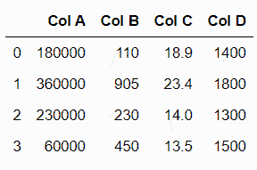
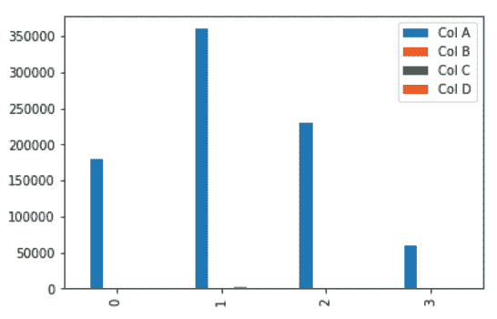

# 熊猫数据标准化

> 原文:[https://www . geesforgeks . org/data-normalization-with-pandas/](https://www.geeksforgeeks.org/data-normalization-with-pandas/)

在这篇文章中，我们将学习如何在熊猫中标准化数据。让我们先讨论一些概念:

*   **Pandas:** Pandas 是一个开源库，建立在 NumPy 库之上。它是一个 Python 包，提供了各种数据结构和操作来操作数字数据和统计数据。主要是因为导入和分析数据容易得多。熊猫速度快，对用户来说是高效的&。
*   **数据标准化**:数据标准化也可以是机器学习中的典型实践，包括将数值列转换为标准标度。在机器学习中，一些特征值与其他特征值相差很多倍。价值较高的特征将主导学习过程。

### 所需步骤

在这里，我们将应用一些技术来规范化数据，并借助示例讨论这些技术。为此，让我们了解熊猫数据标准化所需的步骤。

1.  导入库(熊猫)
2.  导入/加载/创建数据。
3.  使用该技术来规范化数据。

### **示例**

这里，我们通过一些随机值创建数据，并对其应用一些规范化技术。

## 蟒蛇 3

```
# importing packages
import pandas as pd

# create data
df = pd.DataFrame([
                   [180000, 110, 18.9, 1400], 
                   [360000, 905, 23.4, 1800], 
                   [230000, 230, 14.0, 1300], 
                   [60000, 450, 13.5, 1500]], 

                   columns=['Col A', 'Col B',
                            'Col C', 'Col D'])

# view data
display(df)
```

**输出:**



请参见此数据框的图表:

## 蟒蛇 3

```
import matplotlib.pyplot as plt
df.plot(kind = 'bar')
```



### 让我们一个一个地应用规范化技术。

### 使用最大绝对缩放

最大绝对缩放通过将每个观察值除以其最大绝对值，在-1 和 1 之间重新缩放每个特征。我们可以使用。max()和。abs()方法，如下所示。

## 蟒蛇 3

```
# copy the data
df_max_scaled = df.copy()

# apply normalization techniques
for column in df_max_scaled.columns:
    df_max_scaled[column] = df_max_scaled[column]  / df_max_scaled[column].abs().max()

# view normalized data
display(df_max_scaled)
```