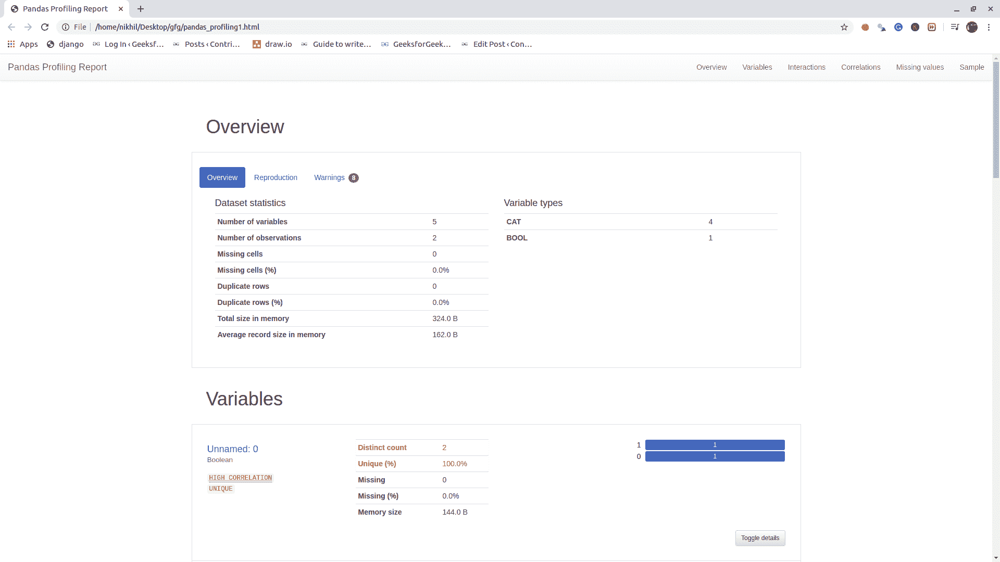
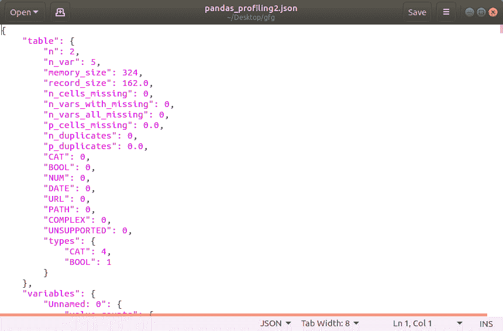

# 使用 Python 对大熊猫进行数据分析

> 原文:[https://www . geesforgeks . org/data-profiling-in-pandas-use-python/](https://www.geeksforgeeks.org/data-profiling-in-pandas-using-python/)

**[熊猫](https://www.geeksforgeeks.org/pandas-tutorial/)** 是最流行的 Python 库之一，主要用于数据操作和分析。当我们处理大数据时，很多时候我们需要执行**探索性数据分析**。我们需要获得不同可用列的详细描述，以及它们之间的关系、空值检查、数据类型、缺失值等。所以，Pandas profiling 是一个 python 模块，它完成 EDA 并给出详细的描述，只需几行代码。

**安装:**

```py
pip install pandas-profiling
```

**示例:**

```py
#import the packages
import pandas as pd
import pandas_profiling

# read the file
df = pd.read_csv('Geeks.csv')

# run the profile report
profile = df.profile_report(title='Pandas Profiling Report')

# save the report as html file
profile.to_file(output_file="pandas_profiling1.html")

# save the report as json file
profile.to_file(output_file="pandas_profiling2.json")
```

**输出:**


**HTML 文件:**



**JSON 文件:**

