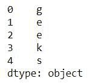
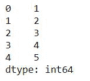
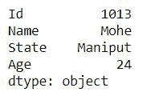
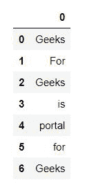
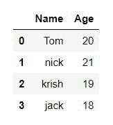
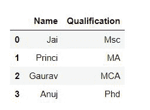
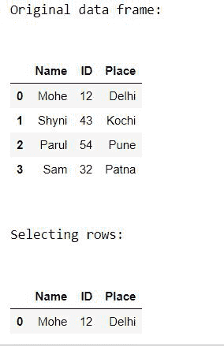
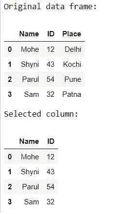

# 熊猫的数据结构

> 原文:[https://www.geeksforgeeks.org/data-structures-in-pandas/](https://www.geeksforgeeks.org/data-structures-in-pandas/)

[**熊猫**](https://www.geeksforgeeks.org/pandas-tutorial/) 是一个开源库，用于轻松直观地处理关系数据或标签数据。它提供各种数据结构和操作来处理数字数据和时间序列。它提供了清理和处理数据的工具。它是最流行的用于数据分析的 Python 库。在这篇文章中，我们将学习熊猫的数据结构。

它支持两种数据结构:

*   [系列](https://www.geeksforgeeks.org/python-pandas-series/)
*   [数据帧](https://www.geeksforgeeks.org/python-pandas-dataframe/)

## 系列

Pandas 是一个一维标记数组，能够保存任何类型的数据(整数、字符串、浮点、python 对象等)。)

> **语法:**熊猫。系列(*数据=无*，*索引=无*，*数据类型=无*，*名称=无*，*副本=假*，*快速路径=假)*
> 
> **参数:**
> 
> *   **数据**:数组-包含串联存储的数据。
> *   **索引**:数组状或索引(1d)
> *   **dtype** : str、numpy.dtype 或 ExtensionDtype，可选
> *   **名称** : str，可选
> *   **复制** : bool，默认 False

**示例 1:** 保存字符数据类型的序列。

## 蟒蛇 3

```py
import pandas as pd

# a simple char list
list = ['g', 'e', 'e', 'k', 's']

# create series form a char list
res = pd.Series(list)
print(res)
```

**输出:**



**示例 2:** 保存 Int 数据类型的序列。

## 蟒蛇 3

```py
import pandas as pd

# a simple int list
list = [1,2,3,4,5]

# create series form a int list
res = pd.Series(list)
print(res)
```

**输出:**



**例 3:** 系列手持字典。

## 蟒蛇 3

```py
import pandas as pd

dic = { 'Id': 1013, 'Name': 'MOhe',
       'State': 'Maniput','Age': 24}

res = pd.Series(dic)
print(res)
```

**输出:**



## 数据帧

**Pandas DataFrame** 是一个二维大小可变、潜在异构的表格数据结构，带有标记轴(行和列)。数据框是一种二维数据结构，即数据以表格形式排列成行和列，如电子表格或 SQL 表，或一组系列对象。。熊猫数据框由三个主要部分组成，即**数据**、**行**和**列**。

### [创建熊猫数据框](https://www.geeksforgeeks.org/creating-a-pandas-dataframe/)

在现实世界中，熊猫数据框架将通过从现有存储中加载数据集来创建，存储可以是 SQL 数据库、CSV 文件和 Excel 文件。熊猫数据框架可以从列表、字典和字典列表等创建。数据框可以用不同的方式创建，以下是我们创建数据框的一些方法:

**示例 1:** 可以使用单个列表或列表列表创建数据框。

## 蟒蛇 3

```py
# import pandas as pd
import pandas as pd

# list of strings
lst = ['Geeks', 'For', 'Geeks', 'is',
            'portal', 'for', 'Geeks']

# Calling DataFrame constructor on list
df = pd.DataFrame(lst)
display(df)
```

**输出:**



**示例 2:** 从一组数据/列表创建数据帧。

要从 narray/list 的 dict 创建 DataFrame，所有 narray 必须具有相同的长度。如果传递了索引，那么长度索引应该等于数组的长度。如果没有传递索引，那么默认情况下，索引将是范围(n)，其中 n 是数组长度。

## 蟒蛇 3

```py
# Python code demonstrate creating
# DataFrame from dict narray / lists
# By default addresses.

import pandas as pd

# initialise data of lists.
data = {'Name':['Tom', 'nick', 'krish', 'jack'],
        'Age':[20, 21, 19, 18]}

# Create DataFrame
df = pd.DataFrame(data)

# Print the output.
display(df)
```

**输出:**



### [**处理数据框中的一列一行**](https://www.geeksforgeeks.org/dealing-with-rows-and-columns-in-pandas-dataframe/)

**列的选择:**为了在熊猫数据框中选择一列，我们可以通过按列名调用列来访问它们。

## 蟒蛇 3

```py
# Import pandas package
import pandas as pd

# Define a dictionary containing employee data
data = {'Name':['Jai', 'Princi', 'Gaurav', 'Anuj'],
        'Age':[27, 24, 22, 32],
        'Address':['Delhi', 'Kanpur', 'Allahabad', 'Kannauj'],
        'Qualification':['Msc', 'MA', 'MCA', 'Phd']}

# Convert the dictionary into DataFrame 
df = pd.DataFrame(data)

# select two columns
print(df[['Name', 'Qualification']])
```

**输出:**



### 如何从熊猫数据框中选择行和列？

**示例 1:** 选择行。

[熊猫。数据框](https://www.geeksforgeeks.org/python-pandas-dataframe-loc/)是一个用于根据提供的条件从熊猫数据框中选择行的函数。

> ***语法:**df . loc[df[' cname ']' condition ']*
> 
> ***参数:***
> 
> *   ***df:** 代表数据帧*
> *   ***cname:** 代表列名*
> *   ***条件:**代表必须选择行的条件*

## 蟒蛇 3

```py
# Importing pandas as pd
from pandas import DataFrame

# Creating a data frame
Data = {'Name': ['Mohe', 'Shyni', 'Parul', 'Sam'],
        'ID': [12, 43, 54, 32],
        'Place': ['Delhi', 'Kochi', 'Pune', 'Patna']
       }

df = DataFrame(Data, columns = ['Name', 'ID', 'Place'])

# Print original data frame
print("Original data frame:\n")
display(df)

# Selecting the product of Electronic Type
select_prod = df.loc[df['Name'] == 'Mohe']

print("\n")

# Print selected rows based on the condition
print("Selecting rows:\n")
display (select_prod)
```

**输出:**



**例 2:** 选择列。

## 蟒蛇 3

```py
# Importing pandas as pd
from pandas import DataFrame

# Creating a data frame
Data = {'Name': ['Mohe', 'Shyni', 'Parul', 'Sam'],
        'ID': [12, 43, 54, 32],
        'Place': ['Delhi', 'Kochi', 'Pune', 'Patna']
       }

df = DataFrame(Data, columns = ['Name', 'ID', 'Place'])

# Print original data frame
print("Original data frame:")
display(df)

print("Selected column: ")
display(df[['Name', 'ID']] )
```

**输出:**

