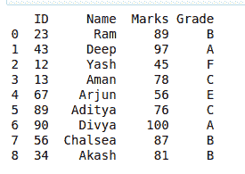

# 熊猫的 DataFrame.read_pickle()方法

> 原文:[https://www . geesforgeks . org/data frame-read _ pickle-in-method-pandas/](https://www.geeksforgeeks.org/dataframe-read_pickle-method-in-pandas/)

**先决条件:**T2【PD . to _ pickle method()

**read_pickle()** 方法用于将给定对象酸洗(序列化)到文件中。此方法使用下面给出的语法:

**语法:**

```py
pd.read_pickle(path, compression='infer')

```

**参数:**

<figure class="table">

| **论据** | **类型** | **描述** |
| --- | --- | --- |
| 小路 | 潜艇用热中子反应堆（submarine thermal reactor 的缩写） | 将加载腌制对象的文件路径。 |
| 压缩 | { '推断'，' gzip '，' bz2 '，' zip '，' xz '，' None ' }，默认为'推断' | 用于磁盘数据的动态解压缩。如果“推断”，则使用 gzip、bz2、xz 或 zip(如果路径以结尾)。gz '，. bz2 '，'。xz '，或'。“zip ”,否则不解压缩。设置为无表示不解压缩。 |

</figure>

下面是上述方法的实现，并附有一些例子:

#### 例 1:

## 蟒蛇 3

```py
# importing packages 
import pandas as pd 

# dictionary of data 
dct = {'ID': {0: 23, 1: 43, 2: 12, 
            3: 13, 4: 67, 5: 89, 
            6: 90, 7: 56, 8: 34}, 
    'Name': {0: 'Ram', 1: 'Deep', 
                2: 'Yash', 3: 'Aman', 
                4: 'Arjun', 5: 'Aditya', 
                6: 'Divya', 7: 'Chalsea', 
                8: 'Akash' }, 
    'Marks': {0: 89, 1: 97, 2: 45, 3: 78, 
                4: 56, 5: 76, 6: 100, 7: 87, 
                8: 81}, 
    'Grade': {0: 'B', 1: 'A', 2: 'F', 3: 'C', 
                4: 'E', 5: 'C', 6: 'A', 7: 'B', 
                8: 'B'} 
    } 

# forming dataframe 
data = pd.DataFrame(dct) 

# using to_pickle function to form file 
# with name 'pickle_file' 
pd.to_pickle(data,'./pickle_file.pkl')

# unpickled the data by using the
# pd.read_pickle method
unpickled_data = pd.read_pickle("./pickle_file.pkl")
print(unpickled_data)
```

**输出:**



**例 2:**

## 蟒蛇 3

```py
# importing packages 
import pandas as pd 

# dictionary of data 
dct = {"f1": range(6), "b1": range(6, 12)} 

# forming dataframe 
data = pd.DataFrame(dct) 

# using to_pickle function to form file 
# with name 'pickle_data' 
pd.to_pickle(data,'./pickle_data.pkl')

# unpickled the data by using the
# pd.read_pickle method
unpickled_data = pd.read_pickle("./pickle_data.pkl")
print(unpickled_data)
```

**输出:**

