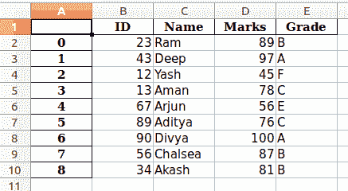

# 熊猫中的 DataFrame.to_excel()方法

> 原文:[https://www . geesforgeks . org/data frame-to _ excel-in-method-pandas/](https://www.geeksforgeeks.org/dataframe-to_excel-method-in-pandas/)

**to_excel()** 方法用于将数据框导出到 excel 文件。要将单个对象写入 excel 文件，我们必须指定目标文件名。如果我们想要写入多个工作表，我们需要创建一个带有目标文件名的 ExcelWriter 对象，并且还需要在我们必须写入的文件中指定工作表。也可以通过指定唯一的工作表名称来写入多个工作表。有必要保存写入文件的所有数据的更改。

**语法:**

```py
data.to_excel( excel_writer, sheet_name='Sheet1', \*\*kwargs )

```

**参数:**

<figure class="table">

| **论据** | **类型** | **描述** |
| --- | --- | --- |
| excel_writer | 字符串或 ExcelWriter 对象 | 文件路径或现有的 ExcelWriter |
| 工作表名称 | 字符串，默认' Sheet1 ' | 将包含数据框的工作表的名称 |
| 列 | 字符串序列或列表，可选 | 要写入的列 |
| 指数 | 布尔，默认为 True | 写行名(索引) |
| 索引标签 | 字符串或序列，可选 | 如果需要，索引列的列标签。如果未指定，并且“标题”和“索引”为真，则使用索引名称。如果数据帧使用多索引，应该给出一个序列。 |

</figure>

*   可以提供 excel 文件名或 Excelwrite 对象。
*   默认情况下，工作表编号为 1，您可以通过输入参数“工作表名称”的值来更改它。
*   可以通过输入参数“columns”的值来提供存储数据的列的名称。
*   默认情况下，索引用数字标记为 0、1、2 …等等，您可以通过传递参数“index”值的列表序列来更改它。

下面是上述方法的实现:

## 蟒蛇 3

```py
# importing packages 
import pandas as pd 

# dictionary of data 
dct = {'ID': {0: 23, 1: 43, 2: 12, 
              3: 13, 4: 67, 5: 89, 
              6: 90, 7: 56, 8: 34}, 
      'Name': {0: 'Ram', 1: 'Deep', 
               2: 'Yash', 3: 'Aman', 
               4: 'Arjun', 5: 'Aditya', 
               6: 'Divya', 7: 'Chalsea', 
               8: 'Akash' }, 
      'Marks': {0: 89, 1: 97, 2: 45, 3: 78, 
                4: 56, 5: 76, 6: 100, 7: 87, 
                8: 81}, 
      'Grade': {0: 'B', 1: 'A', 2: 'F', 3: 'C', 
                4: 'E', 5: 'C', 6: 'A', 7: 'B', 
                8: 'B'} 
    } 

# forming dataframe
data = pd.DataFrame(dct) 

# storing into the excel file
data.to_excel("output.xlsx")
```

**输出:**



在上面的例子中，

*   默认情况下，索引标记为 0，1，…。等等。
*   因为我们的数据框有列名，所以列被标记。
*   默认情况下，它保存在“Sheet1”中。