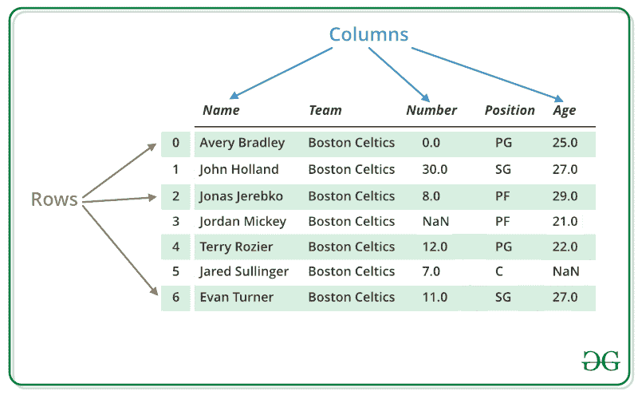
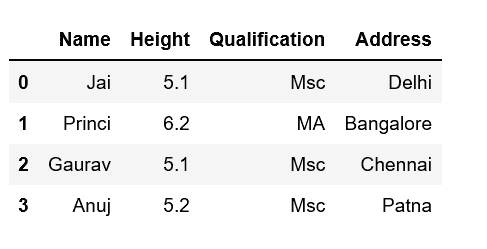
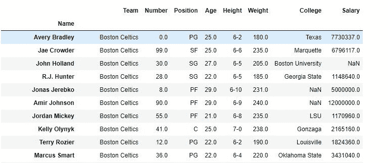
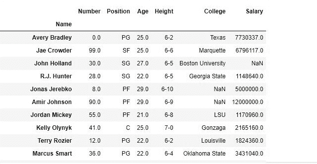
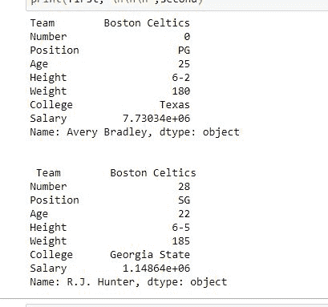
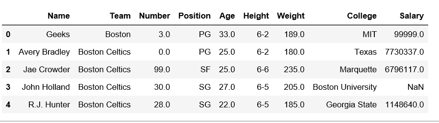
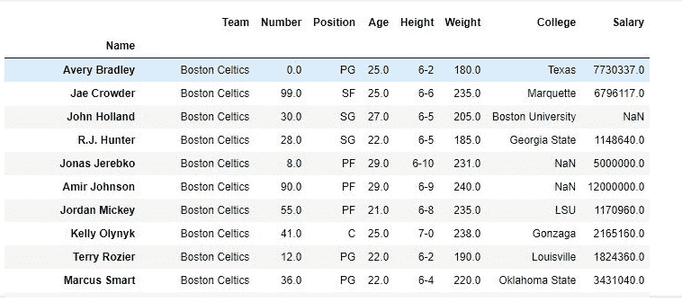
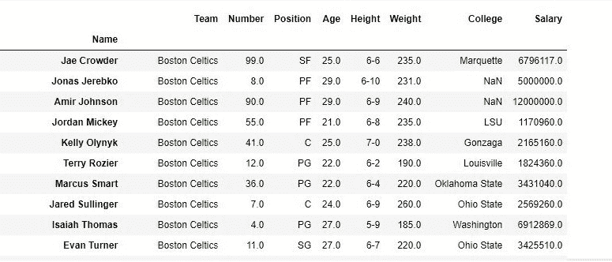

# 处理熊猫数据框中的行和列

> 原文:[https://www . geeksforgeeks . org/处理熊猫中的行和列-dataframe/](https://www.geeksforgeeks.org/dealing-with-rows-and-columns-in-pandas-dataframe/)

数据框是一种二维数据结构，即数据以表格形式排列成行和列。我们可以对行/列执行基本操作，如选择、删除、添加和重命名。在本文中，我们使用的是 [`nba.csv`](https://media.geeksforgeeks.org/wp-content/uploads/nba.csv) 文件。


### 处理列

为了处理列，我们对列执行基本操作，如选择、删除、添加和重命名。


**[【列选择】](https://www.geeksforgeeks.org/how-to-select-multiple-columns-in-a-pandas-dataframe/) :**
为了在熊猫数据框中选择一列，我们可以通过按列名来访问这些列。

```
# Import pandas package
import pandas as pd

# Define a dictionary containing employee data
data = {'Name':['Jai', 'Princi', 'Gaurav', 'Anuj'],
        'Age':[27, 24, 22, 32],
        'Address':['Delhi', 'Kanpur', 'Allahabad', 'Kannauj'],
        'Qualification':['Msc', 'MA', 'MCA', 'Phd']}

# Convert the dictionary into DataFrame 
df = pd.DataFrame(data)

# select two columns
print(df[['Name', 'Qualification']])
```

**输出:**

更多示例参考[如何在熊猫数据框中选择多列](https://www.geeksforgeeks.org/how-to-select-multiple-columns-in-a-pandas-dataframe/)

**[列添加](https://www.geeksforgeeks.org/adding-new-column-to-existing-dataframe-in-pandas/) :**
为了在熊猫数据框中添加一列，我们可以将新列表声明为一列并添加到现有数据框中。

```
# Import pandas package 
import pandas as pd

# Define a dictionary containing Students data
data = {'Name': ['Jai', 'Princi', 'Gaurav', 'Anuj'],
        'Height': [5.1, 6.2, 5.1, 5.2],
        'Qualification': ['Msc', 'MA', 'Msc', 'Msc']}

# Convert the dictionary into DataFrame
df = pd.DataFrame(data)

# Declare a list that is to be converted into a column
address = ['Delhi', 'Bangalore', 'Chennai', 'Patna']

# Using 'Address' as the column name
# and equating it to the list
df['Address'] = address

# Observe the result
print(df)
```

**输出:**

更多例子参考[在熊猫](https://www.geeksforgeeks.org/adding-new-column-to-existing-dataframe-in-pandas/)

**[列删除](https://www.geeksforgeeks.org/python-delete-rows-columns-from-dataframe-using-pandas-drop/) :**
为了删除熊猫数据框中的一列，我们可以使用`drop()`方法。通过删除具有列名的列来删除列。

```
# importing pandas module
import pandas as pd

# making data frame from csv file
data = pd.read_csv("nba.csv", index_col ="Name" )

# dropping passed columns
data.drop(["Team", "Weight"], axis = 1, inplace = True)

# display
print(data)
```

**输出:**
如输出图像所示，新输出没有传递的列。由于 axis 设置为等于 1，这些值被删除，并且由于 inplace 为 True，原始数据框中进行了更改。

**删除列前的数据框-**


**删除列后的数据框-**

更多示例请参考[使用 Pandas.drop()](https://www.geeksforgeeks.org/python-delete-rows-columns-from-dataframe-using-pandas-drop/) 从数据框中删除列

### 处理行:

为了处理行，我们可以对行执行基本操作，如选择、删除、添加和重命名。

**[行选择](https://www.geeksforgeeks.org/python-pandas-extracting-rows-using-loc/) :**
熊猫提供了一种从数据框中检索行的独特方法。`[DataFrame.loc[]](https://www.geeksforgeeks.org/python-pandas-extracting-rows-using-loc/)`方法用于从熊猫数据框中检索行。也可以通过将整数位置传递给 [iloc[]](https://www.geeksforgeeks.org/python-extracting-rows-using-pandas-iloc/) 函数来选择行。

```
# importing pandas package
import pandas as pd

# making data frame from csv file
data = pd.read_csv("nba.csv", index_col ="Name")

# retrieving row by loc method
first = data.loc["Avery Bradley"]
second = data.loc["R.J. Hunter"]

print(first, "\n\n\n", second)
```

**输出:**
如输出图像所示，由于两次都只有一个参数，所以返回了两个序列。

更多示例请参考[熊猫提取行使用。loc[]](https://www.geeksforgeeks.org/python-pandas-extracting-rows-using-loc/)

**[行添加](https://www.geeksforgeeks.org/add-a-row-at-top-in-pandas-dataframe/) :**
为了在 Pandas DataFrame 中添加一行，我们可以将旧的数据帧与新的数据帧串联起来。

```
# importing pandas module 
import pandas as pd 

# making data frame 
df = pd.read_csv("nba.csv", index_col ="Name") 

df.head(10)

new_row = pd.DataFrame({'Name':'Geeks', 'Team':'Boston', 'Number':3,
                        'Position':'PG', 'Age':33, 'Height':'6-2',
                        'Weight':189, 'College':'MIT', 'Salary':99999},
                                                            index =[0])
# simply concatenate both dataframes
df = pd.concat([new_row, df]).reset_index(drop = True)
df.head(5)
```

**输出:**

**添加行前数据框-**


**添加行后数据框-**


更多示例参考[在熊猫数据框顶部添加一行](https://www.geeksforgeeks.org/add-a-row-at-top-in-pandas-dataframe/)

**[行删除](https://www.geeksforgeeks.org/python-delete-rows-columns-from-dataframe-using-pandas-drop/) :**
为了删除熊猫数据框中的一行，我们可以使用 drop()方法。通过按索引标签删除行来删除行。

```
# importing pandas module
import pandas as pd

# making data frame from csv file
data = pd.read_csv("nba.csv", index_col ="Name" )

# dropping passed values
data.drop(["Avery Bradley", "John Holland", "R.J. Hunter",
                            "R.J. Hunter"], inplace = True)

# display
data
```

**输出:**
如输出图像所示，新输出没有传递的值。这些值被删除，并且在原始数据帧中进行了更改，因为 inplace 为 True。

**删除值前的数据框-**


**删除值后的数据框-**

更多示例请参考[使用 Pandas.drop()从数据框中删除行](https://www.geeksforgeeks.org/python-delete-rows-columns-from-dataframe-using-pandas-drop/)

**与列相关的问题:**

*   [如何在熊猫数据框](https://www.geeksforgeeks.org/how-to-get-column-names-in-pandas-dataframe/)中获取列名
*   [如何重命名熊猫数据框](https://www.geeksforgeeks.org/how-to-rename-columns-in-pandas-dataframe/)中的列
*   [如何在熊猫数据框中放置一列或多列](https://www.geeksforgeeks.org/how-to-drop-one-or-multiple-columns-in-pandas-dataframe/)
*   [从熊猫数据框的一列中获取唯一值](https://www.geeksforgeeks.org/get-unique-values-from-a-column-in-pandas-dataframe/)
*   [熊猫数据框中如何小写列名](https://www.geeksforgeeks.org/how-to-lowercase-column-names-in-pandas-dataframe/)
*   [对熊猫数据框中的一列应用大写](https://www.geeksforgeeks.org/apply-uppercase-to-a-column-in-pandas-dataframe/)
*   [将熊猫数据框中一列的第一个字母大写](https://www.geeksforgeeks.org/capitalize-first-letter-of-a-column-in-pandas-dataframe/)
*   [从熊猫数据框的特定列中获取 n 个最大值](https://www.geeksforgeeks.org/get-n-largest-values-from-a-particular-column-in-pandas-dataframe/)
*   [从熊猫数据框的特定列中获取 n 个最小值](https://www.geeksforgeeks.org/get-n-smallest-values-from-a-particular-column-in-pandas-dataframe/)
*   [将熊猫中的列转换为行名称/索引](https://www.geeksforgeeks.org/convert-a-column-to-row-name-index-in-pandas/)

**与行相关的问题:**

*   [对熊猫数据框中的每一行应用功能](https://www.geeksforgeeks.org/apply-function-to-every-row-in-a-pandas-dataframe/)
*   [如何在熊猫数据框](https://www.geeksforgeeks.org/how-to-get-rows-index-names-in-pandas-dataframe/)中获取行名