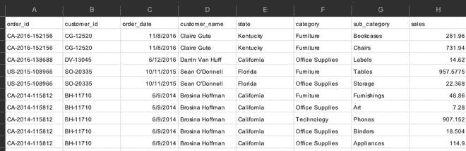
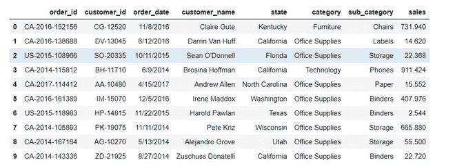
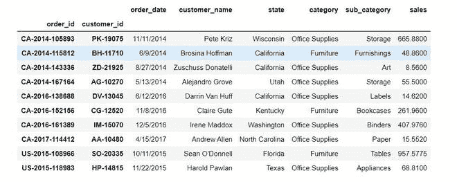

# 基于两列删除熊猫数据框中的重复项

> 原文:[https://www . geesforgeks . org/delete-熊猫中的重复-基于数据框的两列/](https://www.geeksforgeeks.org/delete-duplicates-in-a-pandas-dataframe-based-on-two-columns/)

数据框是一种二维的、大小可变的表格数据结构，带有标记的轴(行和列)。它可以包含重复的条目，删除它们有几种方法。

让我们考虑以下[数据集](https://drive.google.com/file/d/1KGzPGdAUj7YaSYNGZGY24uDqsZsJjZPI/view)。



dataframe 在 order_id 和 customer_id 列中包含重复值。以下是基于两列从数据框中删除重复值的方法。

**方法 1:使用 drop_duplicates()**

**进场:**

*   我们将基于两列删除重复的列
*   让这些列为“订单 id”和“客户 id”
*   仅保留最新条目
*   重置数据帧的索引

**下面是上述方法的 python 代码。**

## 蟒蛇 3

```py
# import pandas library
import pandas as pd

# load data
df1 = pd.read_csv("super.csv")

# drop rows which have same order_id
# and customer_id and keep latest entry
newdf = df1.drop_duplicates(
  subset = ['order_id', 'customer_id'],
  keep = 'last').reset_index(drop = True)

# print latest dataframe
display(newdf)
```

**输出:**



**方法二:使用 groupby()**

**进场:**

*   我们将根据两列对行进行分组
*   让这些列为“订单 id”和“客户 id”
*   只保留第一个条目

**下面给出了上述方法的 python 代码。**

## 蟒蛇 3

```py
# import pandas library
import pandas as pd

# read data
df1 = pd.read_csv("super.csv")

# group data over columns 'order_id'
# and 'customer_id' and keep first entry only
newdf1 = df1.groupby(['order_id', 'customer_id']).first()

# print new dataframe
print(newdf1)
```

**输出:**

