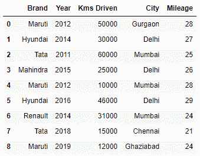
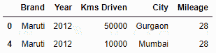
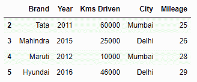
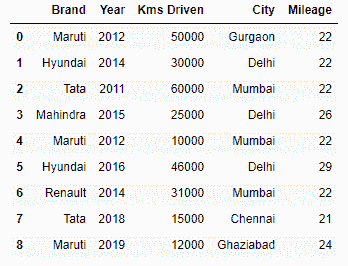
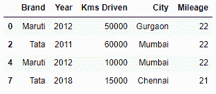
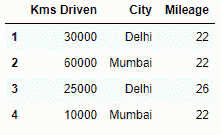

# 熊猫数据框中 loc()和 iloc()的区别

> 原文:[https://www . geeksforgeeks . org/in-loc-and-iloc-in-pandas-data frame/](https://www.geeksforgeeks.org/difference-between-loc-and-iloc-in-pandas-dataframe/)

python 的 Pandas 库对于数学数据的处理非常有用，在机器学习领域得到了广泛的应用。它由许多方法组成，以保证其正常运行。[**`loc()`**](https://www.geeksforgeeks.org/python-pandas-dataframe-loc/)[**`iloc()`**](https://www.geeksforgeeks.org/python-extracting-rows-using-pandas-iloc/)就是其中一种方法。这些用于从熊猫数据帧中分割数据。它们有助于从数据框中方便地选择数据。它们用于根据某些条件过滤数据。汽车样本数据集中解释了这两种方法的工作原理。

```
# importing the module
import pandas as pd

# creating a sample dataframe
data = pd.DataFrame({'Brand' : ['Maruti', 'Hyundai', 'Tata',
                                'Mahindra', 'Maruti', 'Hyundai',
                                'Renault', 'Tata', 'Maruti'],
                     'Year' : [2012, 2014, 2011, 2015, 2012, 
                               2016, 2014, 2018, 2019],
                     'Kms Driven' : [50000, 30000, 60000, 
                                     25000, 10000, 46000, 
                                     31000, 15000, 12000],
                     'City' : ['Gurgaon', 'Delhi', 'Mumbai', 
                               'Delhi', 'Mumbai', 'Delhi', 
                               'Mumbai','Chennai',  'Ghaziabad'],
                     'Mileage' :  [28, 27, 25, 26, 28, 
                                   29, 24, 21, 24]})

# displaying the DataFrame
display(data)
```

**输出:**


**loc()** : `loc()`是基于标签的数据选择方法，这意味着我们必须传递我们想要选择的行或列的名称。这个方法包括传递到它的范围的最后一个元素，不像`iloc()`。`loc()`可以接受布尔数据不像`iloc()`。许多操作可以使用`loc()`方法进行，如-

**1。**根据一些条件选择数据:

```
# selecting cars with brand 'Maruti' and Mileage > 25
display(data.loc[(data.Brand == 'Maruti') & (data.Mileage > 25)])
```

**输出:**


**2。**从数据框中选择一系列行:

```
# selecting range of rows from 2 to 5
display(data.loc[2 : 5])
```

**输出:**


**3。**更新任意列的值:

```
# updating values of Mileage if Year < 2015
data.loc[(data.Year < 2015), ['Mileage']] = 22
display(data)
```

**输出:**


**iloc() :** `iloc()`是一种基于索引的选择方法，这意味着我们必须在方法中传递整数索引来选择特定的行/列。与`loc()`不同，该方法不包括传递到其中的范围的最后一个元素。`iloc()`不像`loc()`那样接受布尔数据。使用`iloc()`执行的操作有:

**1。**使用整数索引选择行:

```
# selecting 0th, 2th, 4th, and 7th index rows
display(data.iloc[[0, 2, 4, 7]])
```

**输出:**


**2。**同时选择一系列列和行:

```
# selecting rows from 1 to 4 and columns from 2 to 4
display(data.iloc[1 : 5, 2 : 5])
```

**输出:**
