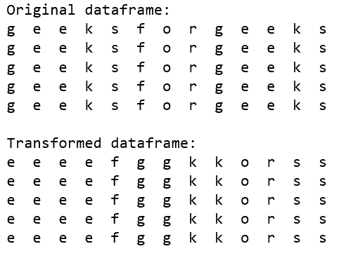
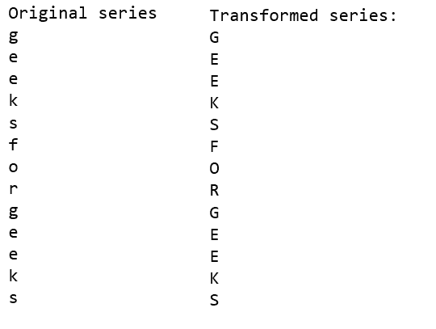
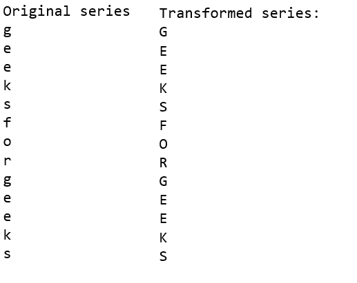

# 熊猫地图、应用地图和应用方法的区别

> 原文:[https://www . geesforgeks . org/地图应用和熊猫应用方法的区别/](https://www.geeksforgeeks.org/difference-between-map-applymap-and-apply-methods-in-pandas/)

熊猫库被广泛用于数据处理和分析。[`map()`](https://www.geeksforgeeks.org/python-pandas-map/)[`applymap()`](https://www.geeksforgeeks.org/python-pandas-dataframe-applymap/)和 [`apply()`](https://www.geeksforgeeks.org/python-pandas-apply/) 的方法都是熊猫库的方法。

> **`applymap()`** 方法只适用于熊猫数据帧，其中函数被单独应用于每个元素。
> 
> **`apply()`** 方法可以应用于序列和数据帧，其中函数可以基于所提供的函数类型应用于序列和单个元素。
> 
> **`map()`** 方法仅适用于熊猫系列，其中要应用的操作类型取决于作为函数、字典或列表传递的参数。

请注意，输出的类型完全取决于给定方法中用作参数的函数的类型。

**熊猫`[apply()](https://www.geeksforgeeks.org/python-pandas-apply/)`方法:**
这种方法既可以用在熊猫的数据框上，也可以用在系列上。作为参数传递的函数通常在行/列上工作。下面的代码说明了`apply()`方法如何在熊猫数据帧上工作。

```
# Importing pandas library with an alias pd
import pandas as pd

# Dataframe generation
gfg_string = 'geeksforgeeks'
gfg_list = 5 * [pd.Series(list(gfg_string))]

gfg_df = pd.DataFrame(data = gfg_list)
print("Original dataframe:\n" + \
      gfg_df.to_string(index = False,
      header = False), end = '\n\n')

# Using apply method for sorting 
# rows of characters present in 
# the original dataframe
new_gfg_df = gfg_df.apply(lambda x:x.sort_values(), axis = 1)

print("Transformed dataframe:\n" + \
       new_gfg_df.to_string(index = False,
            header = False), end = '\n\n')
```

**输出:**


下面的代码说明了熊猫系列的`apply()`方法:

```
# Importing pandas library with an alias pd
import pandas as pd

# Series generation
gfg_string = 'geeksforgeeks'
gfg_series = pd.Series(list(gfg_string))
print("Original series\n" + \
       gfg_series.to_string(index = False,
            header = False), end = '\n\n')

# Using apply method for converting characters
# present in the original series
new_gfg_series = gfg_series.apply(str.upper)
print("Transformed series:\n" + \
       new_gfg_series.to_string(index = False,
                header = False), end = '\n\n')
```

**输出:**


**熊猫 [`applymap()`](https://www.geeksforgeeks.org/python-pandas-dataframe-applymap/) 方法:**
此方法可用于熊猫数据框。作为参数传递的函数通常对数据框的元素起作用`applymap()`通常用于元素操作。下面的代码说明了`applymap`方法如何在熊猫数据帧上工作:

```
# Importing pandas library with an alias pd
import pandas as pd

# DataFrame generation
gfg_string = 'geeksforgeeks'
gfg_list = 5 * [pd.Series(list(gfg_string))]
gfg_df = pd.DataFrame(data = gfg_list)

print("Original dataframe:\n" + \
       gfg_df.to_string(index = False,
        header = False), end = '\n\n')

# Using applymap method for transforming 
# characters into uppercase characters 
# present in the original dataframe
new_gfg_df = gfg_df.applymap(str.upper)
print("Transformed dataframe:\n" + \
       new_gfg_df.to_string(index = False,
            header = False), end = '\n\n')
```

**输出:**


**熊猫`[map()](https://www.geeksforgeeks.org/python-pandas-map/)`方法:**
该方法用于串联函数，列表和字典作为参数传递。此方法通常用于映射同一列中两个系列的值。下面的代码说明了`map`方法如何在熊猫系列上工作:

```
# Importing pandas library with an alias pd
import pandas as pd

# Series generation
gfg_string = 'geeksforgeeks'
gfg_series = pd.Series(list(gfg_string))
print("Original series\n" + \
       gfg_series.to_string(index = False,
            header = False), end = '\n\n')

# Using apply method for converting characters
# present in the original series
new_gfg_series = gfg_series.map(str.upper)
print("Transformed series:\n" + \
       new_gfg_series.to_string(index = False,
                header = False), end = '\n\n')
```

**输出:**
