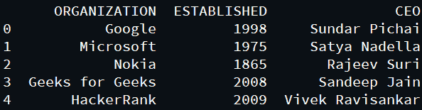
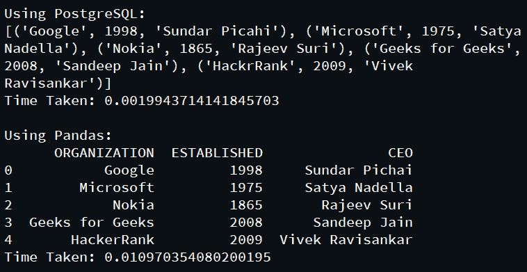
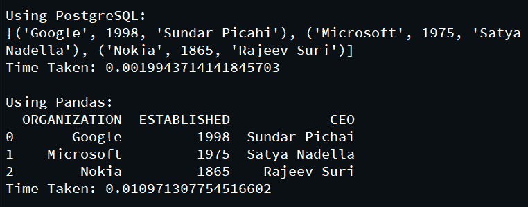
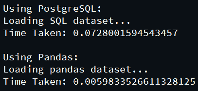

# 熊猫和 PostgreSQL 的区别

> 原文:[https://www . geesforgeks . org/pandas-and-PostgreSQL/](https://www.geeksforgeeks.org/difference-between-pandas-and-postgresql/)之间的差异

[**熊猫:**](https://www.geeksforgeeks.org/pandas-tutorial/) Python 支持内置库*熊猫*，进行数据分析和操纵是一种快速高效的方式。 *Pandas* 库处理一维数组(称为系列)和多维数组(称为数据框)中可用的数据。它提供了各种各样的功能和实用程序来执行数据转换和操作。使用 n *umpy* 模块进行统计建模、过滤、文件操作、排序以及导入或导出是 *Pandas* 库的一些关键功能。大数据的处理和挖掘更加方便用户。

**PostgreSQL:** 它是一个开源的关系数据库管理系统，主要用于各种应用的数据存储。 *PostgreSQL* 用更少的数据集执行数据操作，比如以更简单、更快速的方式进行排序、插入、更新和删除。它通过 *SQL* 查询模拟数据分析和转换。它以更高的安全性和完整性提供了灵活的数据存储和复制。它确保的主要特性是原子性、一致性、隔离性和持久性(ACID)来处理并发事务。

### 表演

为了比较两个模块的性能，我们将对下面的数据集执行一些操作:



**可以将该数据集加载到相应的帧中，然后可以针对不同的操作计算它们的性能:**

*   **选择:**显示数据集的所有行

## 蟒蛇 3

```
# import required modules
import time
import psycopg2
import pandas

# connect to server and load SQL database
db = psycopg2.connect(database="postgres",
                      user="postgres",
                      password="12345",
                      host="127.0.0.1",
                      port="5432")
db = conn.cursor()

# load pandas dataset
df = pandas.read_csv('gfg.csv')

print('\nUsing PostgreSQL:')

# computing time taken by PostgreSQL
begin = time.time()
db.execute("SELECT * FROM gfg")
print(db.fetchall())
end = time.time()
print('Time Taken:', end-begin)

print('\nUsing Pandas:')

# computing time taken by Pandas
begin = time.time()
print(df)
end = time.time()
print('Time Taken:', end-begin)
```

**输出:**



*   **排序:**按照升序对数据进行排序。

## 蟒蛇 3

```
# import required modules
import time
import psycopg2
import pandas

# connect to server and load SQL database
db = psycopg2.connect(database="postgres",
                      user="postgres",
                      password="12345",
                      host="127.0.0.1",
                      port="5432")
cur = db.cursor()

# load pandas dataset
df = pandas.read_csv('gfg.csv')

print('\nUsing PostgreSQL:')

# computing time taken by PostgreSQL
begin = time.time()
print('Sorting data...')
cur.execute("SELECT * FROM gfg order by ESTABLISHED")
print(cur.fetchall())
end = time.time()
print('Time Taken:', end-begin)

print('\nUsing Pandas:')

# computing time taken by Pandas
begin = time.time()
print('Sorting data...')
df.sort_values(by=['ESTABLISHED'], inplace=True)
print(df)
end = time.time()
print('Time Taken:', end-begin)
```

**输出:**


*   **过滤:**从数据集中提取一些行。

## 蟒蛇 3

```
# import required modules
import time
import psycopg2
import pandas

# connect to server and load SQL database
db = psycopg2.connect(database="postgres",
                      user="postgres",
                      password="12345",
                      host="127.0.0.1",
                      port="5432")
cur = db.cursor()

# load pandas dataset
df = pandas.read_csv('gfg.csv')

print('\nUsing PostgreSQL:')

# computing time taken by PostgreSQL
begin = time.time()
cur.execute("SELECT * FROM gfg where ESTABLISHED < 2000")
print(cur.fetchall())
end = time.time()
print('Time Taken:', end-begin)

print('\nUsing Pandas:')

# computing time taken by Pandas
begin = time.time()
print(df[df['ESTABLISHED'] < 2000])
end = time.time()
print('Time Taken:', end-begin)
```

**输出:**



*   **加载:**加载数据集。

## 蟒蛇 3

```
# import required modules
import time
import psycopg2
import pandas

print('\nUsing PostgreSQL:')

# computing time taken by PostgreSQL
begin = time.time()
# connect to server and load SQL database
print('Loading SQL dataset...')
db = psycopg2.connect(database="postgres",
                      user="postgres",
                      password="12345",
                      host="127.0.0.1",
                      port="5432")
cur = db.cursor()
end = time.time()
print('Time Taken:', end-begin)

print('\nUsing Pandas:')

# computing time taken by Pandas
begin = time.time()
print('Loading pandas dataset...')
# load pandas dataset
df = pandas.read_csv('gfg.csv')
end = time.time()
print('Time Taken:', end-begin)
```

**输出:**



**下表说明了执行这些操作所需的时间:**

<figure class="table">

| **查询** | 

**PostgreSQL**

**(以秒为单位的时间)**

 | 

**熊猫**

**(以秒为单位的时间)**

 |
| --- | --- | --- |
| 挑选 | 0.0019 | 0.0109 |
| 分类 | 0.0009 | 0.0069 |
| 过滤器 | 0.0019 | 0.0109 |
| 负荷 | 0.0728 | 0.0059 |

</figure>

因此，我们可以得出结论:*熊猫*模块在几乎每一个操作中都比 *PostgreSQL* 慢，除了加载操作。

### 熊猫 VS PostgreSQL

<figure class="table">

| 

**熊猫**

 | 

**PostgreSQL**

 |
| --- | --- |
| 设置很简单。 | 安装程序需要优化查询。 |
| 复杂性更低，因为它只是一个需要导入的包。 | 配置和数据库配置增加了执行的复杂性和时间。 |
| 数学、统计和程序方法，如 *UDF* 得到了有效的处理。 | 数学、统计学和程序方法如 *UDF* 表现不够好。 |
| 可靠性和可扩展性较差。 | 可靠性和可扩展性要好得多。 |
| 只有技术知识渊博的人才能执行数据操作。 | 易于阅读和理解，因为 SQL 是一种结构化语言。 |
| 无法轻松与其他语言和应用程序集成。 | 可以轻松集成，为所有语言提供支持。 |
| 安全受到威胁。 | 由于 ACID 属性，安全性更高。 |

</figure>

因此，在执行简单数据操作(如数据检索、处理、连接、过滤)的地方，PostgreSQL 可以被认为更好、更易于使用。但是，对于大型数据挖掘和操作，查询优化，竞争超过了它的简单性，因此，熊猫表现得更好。