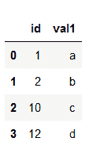
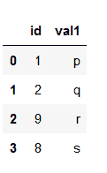

# 大熊猫不同类型的联结

> 原文:[https://www . geesforgeks . org/不同类型的加入熊猫/](https://www.geeksforgeeks.org/different-types-of-joins-in-pandas/)

*pands*模块包含各种功能，可对数据帧执行各种操作，如连接、连接、删除、添加等。在本文中，我们将讨论可以在*熊猫*数据帧上执行的各种类型的连接操作。熊猫的联结主要有五种类型:

*   内部连接
*   左外连接
*   右外连接
*   完全外连接或简单的外连接
*   索引连接

为了理解不同类型的连接，我们将首先制作两个数据帧，即 **a** 和 **b** 。

**Dataframe a:**

## 蟒蛇 3

```py
# importing pandas

import pandas as pd

# Creating dataframe a
a = pd.DataFrame()

# Creating Dictionary
d = {'id': [1, 2, 10, 12], 
     'val1': ['a', 'b', 'c', 'd']}

a = pd.DataFrame(d)

# printing the dataframe
a
```

**输出:**



**DataFrame b:**

## 蟒蛇 3

```py
# importing pandas
import pandas as pd

# Creating dataframe b
b = pd.DataFrame()

# Creating dictionary
d = {'id': [1, 2, 9, 8],
     'val1': ['p', 'q', 'r', 's']}
b = pd.DataFrame(d)

# printing the dataframe
b
```

**输出:**



我们将使用这两个数据帧来理解不同类型的连接。

*   **内部连接:**内部连接是您将使用的最常见的连接类型。它只返回具有共同特征的那些行的数据帧。这类似于两个集合的交集。


**示例:**

## 蟒蛇 3

```py
# importing pandas
import pandas as pd

# Creating dataframe a
a = pd.DataFrame()

# Creating Dictionary
d = {'id': [1, 2, 10, 12],
     'val1': ['a', 'b', 'c', 'd']}

a = pd.DataFrame(d)

# Creating dataframe b
b = pd.DataFrame()

# Creating dictionary
d = {'id': [1, 2, 9, 8],
     'val1': ['p', 'q', 'r', 's']}
b = pd.DataFrame(d)

# inner join
df = pd.merge(a, b, on='id', how='inner')

# display dataframe
df
```

**输出:**


*   **左外连接:** 使用左外连接，将显示第一个数据帧中的所有记录，而不管第一个数据帧中的键是否可以在第二个数据帧中找到。而对于第二个数据帧，将只显示在第一个数据帧中可以找到的第二个数据帧中具有关键字的记录。


**示例:**

## 蟒蛇 3

```py
# importing pandas
import pandas as pd

# Creating dataframe a
a = pd.DataFrame()

# Creating Dictionary
d = {'id': [1, 2, 10, 12],
     'val1': ['a', 'b', 'c', 'd']}

a = pd.DataFrame(d)

# Creating dataframe b
b = pd.DataFrame()

# Creating dictionary
d = {'id': [1, 2, 9, 8],
     'val1': ['p', 'q', 'r', 's']}
b = pd.DataFrame(d)

# left outer join
df = pd.merge(a, b, on='id', how='left')

# display dataframe
df
```