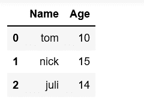
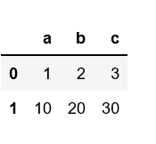
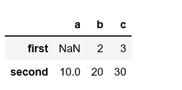
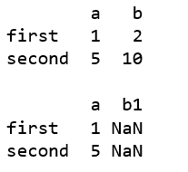
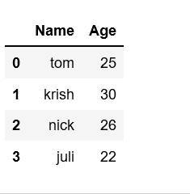
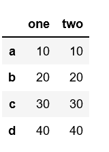

# 创建熊猫数据框的不同方式

> 原文:[https://www . geeksforgeeks . org/different-to-create-pandas-data frame/](https://www.geeksforgeeks.org/different-ways-to-create-pandas-dataframe/)

**Pandas DataFrame** 是一个带有可能不同类型的列的二维标记数据结构。它一般是熊猫最常用的对象。
熊猫数据框可以通过多种方式创建。让我们逐一讨论创建数据框的不同方法。
**方法#1:** 从列表列表中创建熊猫数据框。

## 蟒蛇 3

```py
# Import pandas library
import pandas as pd

# initialize list of lists
data = [['tom', 10], ['nick', 15], ['juli', 14]]

# Create the pandas DataFrame
df = pd.DataFrame(data, columns = ['Name', 'Age'])

# print dataframe.
df
```

**输出:**



**方法 2:** 从 narray/list 的字典创建数据帧
要从 narray/list 的字典创建数据帧，所有 narray 必须具有相同的长度。如果传递了索引，那么长度索引应该等于数组的长度。如果没有传递索引，那么默认情况下，索引将是范围(n)，其中 n 是数组长度。

## 蟒蛇 3

```py
# Python code demonstrate creating 
# DataFrame from dict narray / lists 
# By default addresses.

import pandas as pd

# initialize data of lists.
data = {'Name':['Tom', 'nick', 'krish', 'jack'],
        'Age':[20, 21, 19, 18]}

# Create DataFrame
df = pd.DataFrame(data)

# Print the output.
df
```

**输出:**


**方法#3:** 使用数组创建索引数据帧。

## 蟒蛇 3

```py
# Python code demonstrate creating 
# pandas DataFrame with indexed by 

# DataFrame using arrays.
import pandas as pd

# initialize data of lists.
data = {'Name':['Tom', 'Jack', 'nick', 'juli'],
        'marks':[99, 98, 95, 90]}

# Creates pandas DataFrame.
df = pd.DataFrame(data, index =['rank1',
                                'rank2',
                                'rank3',
                                'rank4'])

# print the data
df
```

**输出:**


**方法#4:** 从字典列表中创建数据框
熊猫数据框可以通过传递字典列表作为输入数据来创建。默认情况下，字典键被视为列。

## 蟒蛇 3

```py
# Python code demonstrate how to create 
# Pandas DataFrame by lists of dicts.
import pandas as pd

# Initialize data to lists.
data = [{'a': 1, 'b': 2, 'c':3},
        {'a':10, 'b': 20, 'c': 30}]

# Creates DataFrame.
df = pd.DataFrame(data)

# Print the data
df
```

**输出:**



另一个通过传递字典列表和行索引来创建熊猫数据帧的例子。

## 蟒蛇 3

```py
# Python code demonstrate to create
# Pandas DataFrame by passing lists of 
# Dictionaries and row indices.
import pandas as pd

# Intitialize data of lists 
data = [{'b': 2, 'c':3}, {'a': 10, 'b': 20, 'c': 30}]

# Creates pandas DataFrame by passing 
# Lists of dictionaries and row index.
df = pd.DataFrame(data, index =['first', 'second'])

# Print the data
df
```

**输出:**



另一个例子是从既有行索引又有列索引的字典列表中创建熊猫数据框。

## 蟒蛇 3

```py
# Python code demonstrate to create a
# Pandas DataFrame with lists of 
# dictionaries as well as 
# row and column indexes.

import pandas as pd

# Intitialize lists data.
data = [{'a': 1, 'b': 2},
        {'a': 5, 'b': 10, 'c': 20}]

# With two column indices, values same 
# as dictionary keys
df1 = pd.DataFrame(data, index =['first',
                                 'second'],
                   columns =['a', 'b'])

# With two column indices with 
# one index with other name
df2 = pd.DataFrame(data, index =['first',
                                 'second'],
                   columns =['a', 'b1'])

# print for first data frame
print (df1, "\n")

# Print for second DataFrame.
print (df2)
```

**输出:**



**方法#5:** 使用 zip()函数创建数据帧。
使用 list(zip())功能可以合并两个列表。现在，通过调用 pd 创建熊猫数据帧。DataFrame()函数。

## 蟒蛇 3

```py
# Python program to demonstrate creating 
# pandas Datadaframe from lists using zip. 

import pandas as pd 

# List1 
Name = ['tom', 'krish', 'nick', 'juli'] 

# List2 
Age = [25, 30, 26, 22] 

# get the list of tuples from two lists. 
# and merge them by using zip(). 
list_of_tuples = list(zip(Name, Age)) 

# Assign data to tuples. 
list_of_tuples  

# Converting lists of tuples into 
# pandas Dataframe. 
df = pd.DataFrame(list_of_tuples,
                  columns = ['Name', 'Age']) 

# Print data. 
df 
```

**输出:**



**方法#6:** 从系列字典创建数据帧。
从系列字典创建数据框，可以传递字典形成数据框。结果索引是所有传递的索引系列的并集。

## 蟒蛇 3

```py
# Python code demonstrate creating
# Pandas Dataframe from Dicts of series.

import pandas as pd

# Initialize data to Dicts of series.
d = {'one' : pd.Series([10, 20, 30, 40],
                       index =['a', 'b', 'c', 'd']),
      'two' : pd.Series([10, 20, 30, 40],
                        index =['a', 'b', 'c', 'd'])}

# creates Dataframe.
df = pd.DataFrame(d)

# print the data.
df
```

**输出:**

