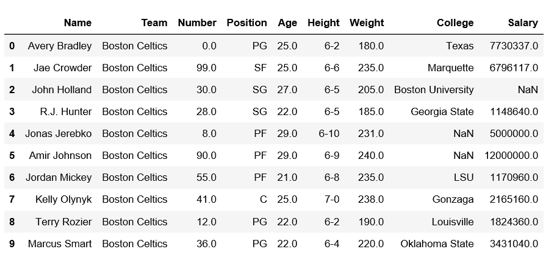
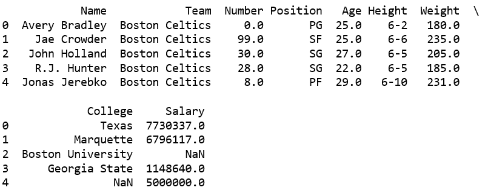
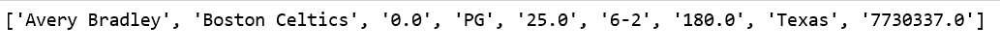

# 熊猫中导入 csv 文件的不同方式

> 原文:[https://www . geesforgeks . org/不同的导入方式-CSV-in-file-pandas/](https://www.geeksforgeeks.org/different-ways-to-import-csv-file-in-pandas/)

CSV 文件是“逗号分隔值”，这些值用逗号分隔，这个文件可以像 excel 文件一样查看。在 Python 中，熊猫是数据科学中最重要的库。我们需要在分析数据的同时处理庞大的数据集，通常可以得到 CSV 文件格式的数据。

让我们看看熊猫中导入 csv 文件的不同方法。

**方法#1:** 使用 read_csv()方法。

```py
# importing pandas module  
import pandas as pd  

# making data frame  
df = pd.read_csv("https://media.geeksforgeeks.org/wp-content/uploads/nba.csv")  

df.head(10) 
```

**输出:**


提供*文件路径*。

```py
# import pandas as pd
import pandas as pd

# Takes the file's folder
filepath = r"C:\Gfg\datasets\nba.csv"

# read the CSV file
df = pd.read_csv(filepath)

# print the first five rows
print(df.head())
```

**输出:**


**方法 2:** 使用`csv` 模块。

可以使用`csv` 模块直接导入 csv 文件。

```py
# import the module csv
import csv
import pandas as pd

# open the csv file
with open(r"C:\Users\Admin\Downloads\nba.csv") as csv_file: 

    # read the csv file
    csv_reader = csv.reader(csv_file, delimiter=',')

    # now we can use this csv files into the pandas
    df = pd.DataFrame([csv_reader], index=None)
    df.head()

# iterating values of first column
for val in list(df[1]):
    print(val)
```

**输出:**
