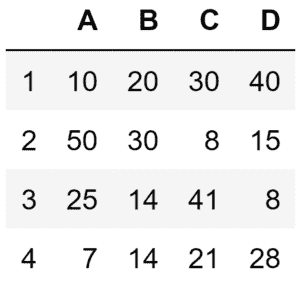
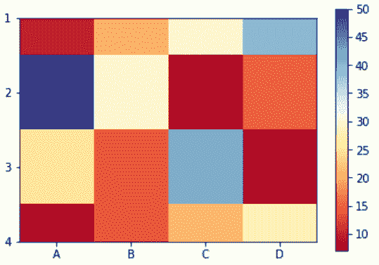
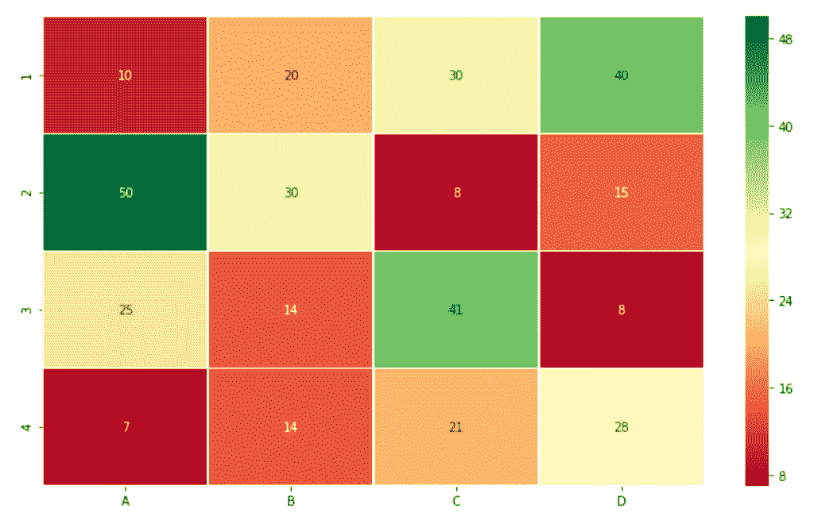
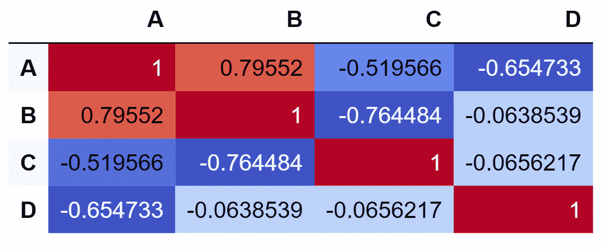
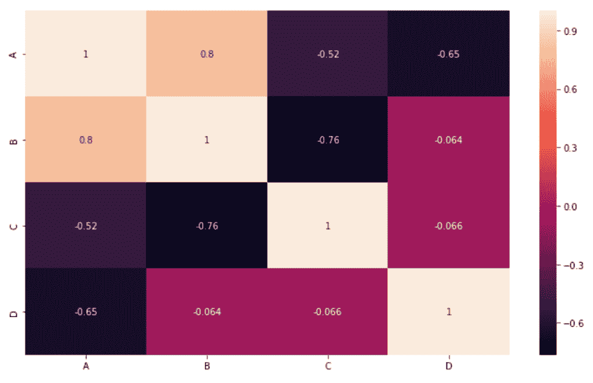

# 以热图方式显示熊猫数据框

> 原文:[https://www . geesforgeks . org/display-the-pandas-data frame-in-heat map-style/](https://www.geeksforgeeks.org/display-the-pandas-dataframe-in-heatmap-style/)

**[熊猫](https://www.geeksforgeeks.org/pandas-tutorial/)** 库在 **[Python](https://www.geeksforgeeks.org/python-programming-language/)** 编程语言中被广泛使用，因为它能够创建各种数据结构，并且它还提供了许多要对数值和时间序列数据执行的操作。通过以热图样式显示熊猫数据帧，用户可以看到数字数据。它概述了完整的数据框架，这使得理解数据框架中的关键点变得非常容易。

热图是一种矩阵形式的二维图形，它以单元格的形式给出数值数据的可视化。热图的每个单元都有颜色，颜色的深浅代表数值与数据帧的某种关系。以下是以热图样式显示熊猫数据帧的一些方法。

#### 以此数据帧为例:



**方法 1:通过使用熊猫库**
在该方法中，熊猫库将用于为其生成数据帧和热图。热图的单元格将显示与数据框相对应的值。下面是实现。

```
# Python program to generate a heatmap
# which displays the value in each cell 
# corresponding to the given dataframe 

# import required libraries
import pandas as pd

# defining index for the dataframe
idx = ['1', '2', '3', '4']

# defining columns for the dataframe
cols = list('ABCD')

# entering values in the index and columns  
# and converting them into a panda dataframe
df = pd.DataFrame([[10, 20, 30, 40], [50, 30, 8, 15],
                   [25, 14, 41, 8], [7, 14, 21, 28]],
                   columns = cols, index = idx)

# displaying dataframe as an heatmap 
# with diverging colourmap as virdis
df.style.background_gradient(cmap ='viridis')\
        .set_properties(**{'font-size': '20px'})
```

**输出:**


**方法 2:通过使用 matplotlib 库**
在该方法中，熊猫数据帧将显示为热图，其中热图的单元将根据数据帧中的值进行颜色编码。除了热图之外，还会出现一个颜色条，作为图形的图例。下面是实现。

```
# Python program to generate a heatmap  
# which represents panda dataframe
# in colour coding schemes

# import required libraries
import matplotlib.pyplot as plt
import pandas as pd

# Defining index for the dataframe
idx = ['1', '2', '3', '4']

# Defining columns for the dataframe
cols = list('ABCD')

# Entering values in the index and columns  
# and converting them into a panda dataframe
df = pd.DataFrame([[10, 20, 30, 40], [50, 30, 8, 15],
                   [25, 14, 41, 8], [7, 14, 21, 28]],
                   columns = cols, index = idx)

# Displaying dataframe as an heatmap
# with diverging colourmap as RdYlBu
plt.imshow(df, cmap ="RdYlBu")

# Displaying a color bar to understand
# which color represents which range of data
plt.colorbar()

# Assigning labels of x-axis 
# according to dataframe
plt.xticks(range(len(df)), df.columns)

# Assigning labels of y-axis 
# according to dataframe
plt.yticks(range(len(df)), df.index)

# Displaying the figure
plt.show()
```

**输出:**


**方法 3:通过使用 Seaborn 库**
在该方法中，将从 Panda 数据帧生成热图，其中热图的单元将包含与数据帧相对应的值，并将被颜色编码。除了热图之外，还会出现一个颜色条，作为图形的图例。下面是实现。

```
# Python program to generate heatmap which 
# represents panda dataframe in color-coding schemes
# along with values mentioned in each cell

# import required libraries
import pandas as pd
import seaborn as sns % matplotlib inline

# Defining figure size  
# for the output plot 
fig, ax = plt.subplots(figsize = (12, 7))

# Defining index for the dataframe
idx = ['1', '2', '3', '4']

# Defining columns for the dataframe
cols = list('ABCD')

# Entering values in the index and columns  
# and converting them into a panda dataframe
df = pd.DataFrame([[10, 20, 30, 40], [50, 30, 8, 15],
                   [25, 14, 41, 8], [7, 14, 21, 28]],
                   columns = cols, index = idx)

# Displaying dataframe as an heatmap 
# with diverging colourmap as RdYlGn
sns.heatmap(df, cmap ='RdYlGn', linewidths = 0.30, annot = True)
```

**输出:**


> 如果输出图形的最上面和最下面的行没有以适当的高度出现，那么在上面代码的最后一行之后添加下面两行。
> 
> ```
> bottom, top = ax.get_ylim()
> ax.set_ylim(bottom + 0.5, top - 0.5)
> ```

**方法 4:使用熊猫库**
生成相关矩阵相关矩阵是一种特殊的热图，显示数据帧的一些见解。此热图的单元格显示相关系数，这是数据框变量之间的线性历史关系。在该方法中，仅使用熊猫库来生成相关矩阵。下面是实现。

```
# Python program to generate heatmap  
# which represents correlation between  
# columns of panda dataframe

# import required libraries
import pandas as pd

# Defining index for the dataframe
idx = ['1', '2', '3', '4']

# Defining columns for the dataframe
cols = list('ABCD')

# Entering values in the index and columns  
# and converting them into a panda dataframe
df = pd.DataFrame([[10, 20, 30, 40], [50, 30, 8, 15],
                   [25, 14, 41, 8], [7, 14, 21, 28]],
                   columns = cols, index = idx)

# generating pairwise correlation
corr = df.corr()

# Displaying dataframe as an heatmap 
# with diverging colourmap as coolwarm
corr.style.background_gradient(cmap ='coolwarm')
```

**输出:**


**方法五:使用 Seaborn 库生成相关矩阵**
相关矩阵也可以使用 Seaborn 库生成。生成的热图的单元将包含相关系数，但是这些值是四舍五入的，不像熊猫库生成的热图。下面是实现。

```
# Python program to generate a heatmap  
# which represents the correlation between  
# columns of panda dataframe

# import required libraries
import pandas as pd
import seaborn as sn

# Defining figure size  
# for the output plot 
fig, ax = plt.subplots(figsize = (12, 7))

# Defining index for the dataframe
idx = ['1', '2', '3', '4']

# Defining columns for the dataframe
cols = list('ABCD')

# Entering values in the index and columns  
# and converting them into a panda dataframe
df = pd.DataFrame([[10, 20, 30, 40], [50, 30, 8, 15],
                   [25, 14, 41, 8], [7, 14, 21, 28]],
                   columns = cols, index = idx)

df = pd.DataFrame(df, columns =['A', 'B', 'C', 'D'])

corr = df.corr()
sn.heatmap(corr, annot = True)
```

**输出:**


如果输出图形的最上面和最下面的行没有以适当的高度出现，那么在上面代码的最后一行之后添加下面两行。

```
bottom, top = ax.get_ylim()
ax.set_ylim(bottom + 0.5, top - 0.5)
```