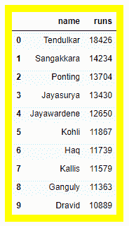
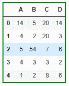

# 以表格样式和表格周围的边框显示熊猫数据框，而不是行周围的边框

> 原文:[https://www . geeksforgeeks . org/display-the-pandas-data frame-in-table-style-围着桌子转而不是围着行转/](https://www.geeksforgeeks.org/display-the-pandas-dataframe-in-table-style-and-border-around-the-table-and-not-around-the-rows/)

让我们看看如何设计熊猫数据框的样式，让它在桌子周围有一个边框。我们将使用熊猫模块中`Styler` 类的 **`set_table_styles()`** 方法。

## set _ table _ styles()

> **语法:**set _ table _ style(self，table _ style)
> 
> **参数:**
> **table_style:**列表中，每个单独的 table _ style 应该是一个带有选择器和道具键的字典。
> 
> **返回:**样式器

**例 1 :**

```py
# import the module
import pandas as pd 

# create a DataFrame 
ODI_runs = {'name': ['Tendulkar', 'Sangakkara', 'Ponting', 
                      'Jayasurya', 'Jayawardene', 'Kohli', 
                      'Haq', 'Kallis', 'Ganguly', 'Dravid'], 
            'runs': [18426, 14234, 13704, 13430, 12650, 
                     11867, 11739, 11579, 11363, 10889]} 
df = pd.DataFrame(ODI_runs)  

# making a yellow border
df.style.set_table_styles([{'selector' : '',
                            'props' : [('border',
                                        '10px solid yellow')]}])
```

**输出:**


**例 2 :**

```py
# import the module
import pandas as pd 

# create a DataFrame 
df = pd.DataFrame({"A":[14, 4, 5, 4, 1], 
                    "B":[5, 2, 54, 3, 2],  
                    "C":[20, 20, 7, 3, 8], 
                    "D":[14, 3, 6, 2, 6]})

# making a green border
df.style.set_table_styles([{'selector' : '',
                            'props' : [('border',
                                        '2px solid green')]}])
```

**输出:**
