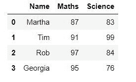
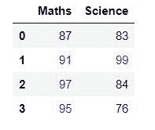
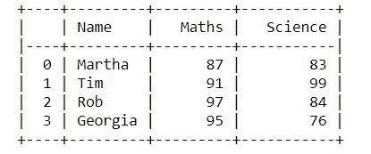

# 以表格方式显示熊猫数据框

> 原文:[https://www . geesforgeks . org/display-the-pandas-data frame-in-table-style/](https://www.geeksforgeeks.org/display-the-pandas-dataframe-in-table-style/)

在本文中，我们将看到如何以表格的形式显示数据框，表格的行和列周围有边框。有必要以表格的形式显示数据框，因为它有助于数据的正确和容易的可视化。现在，让我们借助一些例子来看看实现这一目标的几种方法。

**示例 1 :** 以表格形式显示数据框的一种方法是使用`IPython.display`的`display()`功能。

```py
# importing the modules
from IPython.display import display
import pandas as pd

# creating a DataFrame
dict = {'Name' : ['Martha', 'Tim', 'Rob', 'Georgia'],
        'Maths' : [87, 91, 97, 95],
        'Science' : [83, 99, 84, 76]}
df = pd.DataFrame(dict)

# displaying the DataFrame
display(df)
```

**输出:**


**示例 2:** 在本例中，我们将使用`DataFrame.style`。它返回一个 Styler 对象，该对象具有格式化和显示数据帧的有用方法。

```py
# importing the module
import pandas as pd

# creating a DataFrame
dict = {'Name' : ['Martha', 'Tim', 'Rob', 'Georgia'],
        'Maths' : [87, 91, 97, 95],
        'Science' : [83, 99, 84, 76]}
df = pd.DataFrame(dict)

# displaying the DataFrame
df.style
```

**输出:**


**示例 3 :** 使用`DataFrame.style`我们还可以为数据框表添加不同的样式。例如，在本例中，我们将使用蓝色显示所有大于 90 的值，其余为黑色。为了实现这一点，我们将使用`DataFrame.style.applymap()`遍历表格的所有值并应用样式。

```py
# importing the modules
import pandas as pd
import numpy as np

def color_negative_red(val):
    """
    Takes a scalar and returns a string with
    the css property `'color: red'` for negative
    strings, black otherwise.
    """
    color = 'blue' if val > 90 else 'black'
    return 'color: % s' % color

# creating a DataFrame
dict = {'Maths' : [87, 91, 97, 95],
        'Science' : [83, 99, 84, 76]}
df = pd.DataFrame(dict)

# displaying the DataFrame
df.style.applymap(color_negative_red)
```

**输出:**


**例 4 :** 我们还可以为此使用一个名为制表的库。它是一个包含不同样式的库，数据帧可以在其中显示。在这个例子中，我们将使用`"psql"`样式。

```py
# importing the modules
from tabulate import tabulate
import pandas as pd

# creating a DataFrame
dict = {'Name':['Martha', 'Tim', 'Rob', 'Georgia'],
        'Maths':[87, 91, 97, 95],
        'Science':[83, 99, 84, 76]}
df = pd.DataFrame(dict)

# displaying the DataFrame
print(tabulate(df, headers = 'keys', tablefmt = 'psql'))
```

**输出:**


以下是您可以使用的所有样式:

*   “普通”
*   “简单”
*   “github”
*   “网格”
*   “花式网格”
*   “管道”
*   " orgtbl "
*   "希拉"
*   "很快"
*   “漂亮”
*   "psql"
*   " rst "
*   " mediawiki "
*   "moinmoin"
*   “青年机架”
*   " html "
*   “乳胶”
*   “乳胶 _ 生”
*   latex_booktabs
*   “纺织品”