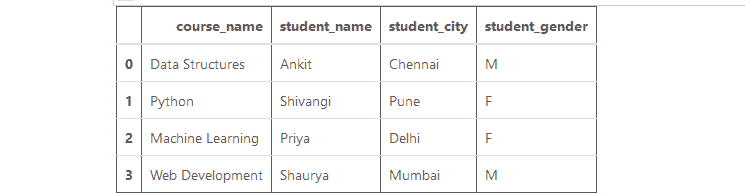
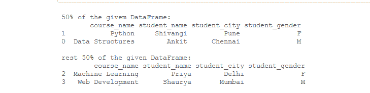
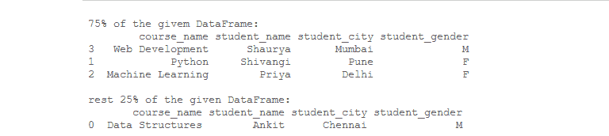

# 按照给定的比例随机分割熊猫数据帧

> 原文:[https://www . geesforgeks . org/divide-a-pandas-data frame-随机给定比率/](https://www.geeksforgeeks.org/divide-a-pandas-dataframe-randomly-in-a-given-ratio/)

在机器学习、人工智能等领域，为了训练和测试的目的，将给定的数据集分割成训练和测试数据的情况下，分割熊猫数据帧任务非常有用。让我们看看如何将熊猫数据帧随机分成给定的比例。对于这个任务，我们将使用[**Dataframe . sample()**](https://www.geeksforgeeks.org/python-pandas-dataframe-sample/)和**[**data frame . drop()**](https://www.geeksforgeeks.org/python-delete-rows-columns-from-dataframe-using-pandas-drop/)熊猫的方法一起进行 data frame。**

**这些函数的语法如下–**

*   ****Dataframe.sample()****

> ****语法:**数据帧.样本(n =无，frac =无，替换=假，权重=无，random _ state =无，轴=无)**
> 
>  ****返回类型:**一个与调用者相同类型的新对象，包含从调用者对象中随机抽样的 n 个项目。**

*   ****Dataframe.drop()****

> ****语法:** DataFrame.drop(标签=无，轴=0，索引=无，列=无，级别=无，位置=假，错误= '提升')**
> 
> ****返回:**具有丢弃值的数据帧。**

****示例:**现在，让我们创建一个数据帧:**

## **蟒蛇 3**

```
# Importing required libraries
import pandas as pd

record = {
    'course_name': ['Data Structures', 'Python',
                    'Machine Learning', 'Web Development'],
    'student_name': ['Ankit', 'Shivangi',
                     'Priya', 'Shaurya'],
    'student_city': ['Chennai', 'Pune',
                     'Delhi', 'Mumbai'],
    'student_gender': ['M', 'F',
                       'F', 'M'] }

# Creating a dataframe
df = pd.DataFrame(record)

# show the dataframe
df
```

****输出:****

**

数据帧** 

****示例 1:** 将数据帧随机分成 1:1 的比例。**

## **蟒蛇 3**

```
# Importing required libraries
import pandas as pd

record = {
    'course_name': ['Data Structures', 'Python',
                    'Machine Learning', 'Web Development'],
    'student_name': ['Ankit', 'Shivangi',
                     'Priya', 'Shaurya'],
    'student_city': ['Chennai', 'Pune',
                     'Delhi', 'Mumbai'],
    'student_gender': ['M', 'F',
                       'F', 'M'] }

# Creating a dataframe
df = pd.DataFrame(record)

# Creating a dataframe with 50%
# values of original dataframe
part_50 = df.sample(frac = 0.5)

# Creating dataframe with
# rest of the 50% values
rest_part_50 = df.drop(part_50.index)

print("\n50% of the given DataFrame:")
print(part_50)

print("\nrest 50% of the given DataFrame:")
print(rest_part_50)
```

****输出:****

**

划分数据帧** 

****示例 2:** 将数据帧随机分成 3:1 的比例。**

## **蟒蛇 3**

```
# Importing required libraries
import pandas as pd

record = {
    'course_name': ['Data Structures', 'Python',
                    'Machine Learning', 'Web Development'],
    'student_name': ['Ankit', 'Shivangi',
                     'Priya', 'Shaurya'],
    'student_city': ['Chennai', 'Pune',
                     'Delhi', 'Mumbai'],
    'student_gender': ['M', 'F',
                       'F', 'M'] }

# Creating a dataframe
df = pd.DataFrame(record)

# Creating a dataframe with 75%
# values of original dataframe
part_75 = df.sample(frac = 0.75)

# Creating dataframe with
# rest of the 25% values
rest_part_25 = df.drop(part_75.index)

print("\n75% of the given DataFrame:")
print(part_75)

print("\nrest 25% of the given DataFrame:")
print(rest_part_25)
```

****输出:****

**

划分数据帧**