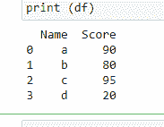
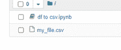
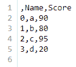
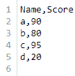
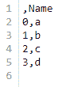
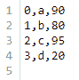
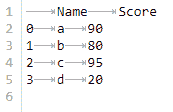

# 将熊猫数据帧导出到 CSV 文件

> 原文:[https://www . geesforgeks . org/export-pandas-data frame-to-a-CSV-file/](https://www.geeksforgeeks.org/export-pandas-dataframe-to-a-csv-file/)

假设您正在进行一个数据科学项目，并且您正在处理一个最重要的任务，即数据清理。数据清理后，您不想丢失已清理的数据框，因此希望将已清理的数据框保存为 CSV。让我们看看如何将熊猫数据帧导出到 CSV 文件。
熊猫通过其内置的**至 _csv()** 功能使我们能够做到这一点。
首先，让我们创建一个示例数据框

## 蟒蛇 3

```
# importing the module
import pandas as pd

# making the data
scores = {'Name': ['a', 'b', 'c', 'd'],
          'Score': [90, 80, 95, 20]}

# creating the DataFrame
df = pd.DataFrame(scores)

# displaying the DataFrame
print(df)
```

**输出:**



现在让我们将这个数据帧导出为一个名为 your_name.csv :
的 CSV 文件

## 蟒蛇 3

```
# converting to CSV file
df.to_csv("your_name.csv")
```

**输出**



文件保存成功



如果您得到一个 UnicodeEncodeError，只需传递带有“utf-8”值的编码参数。

## 蟒蛇 3

```
# converting to CSV file
df.to_csv("your_name.csv", encoding = 'utf-8')
```

### 可能的自定义

1.**包含索引号**
如果要添加自动索引可以选择。默认值为“真”。将其设置为假。

## 蟒蛇 3

```
# converting to CSV file
df.to_csv('your_name.csv', index = False)
```

**输出:**



2.**仅导出选定的列**
如果您只想导出几个选定的列，您可以将其作为‘columns =[“col 1”、“col 2”]
传递给 _csv()

## 蟒蛇 3

```
# converting to CSV file
df.to_csv("your_name.csv", columns = ['Name'])
```

**输出:**



3.**导出标题**
您可以通过将标题参数设置为真或假来选择是否要导出列名。默认值为“真”。

## 蟒蛇 3

```
# converting to CSV file
df.to_csv('your_name.csv', header = False) 
```

**输出:**



4.**处理 NaN**
如果你的数据框有 NaN 值，你可以选择用其他字符串替换。默认值为”。

## 蟒蛇 3

```
# converting to CSV file
df.to_csv("your_name.csv", na_rep = 'nothing')
```

5.**用别的东西分开**
如果不用逗号分隔值，我们可以用自定义值来分隔。

## 蟒蛇 3

```
# converting to CSV file
# separated with tabs
df.to_csv("your_name.csv", sep ='\t')
```

**输出:**

