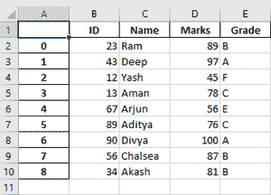
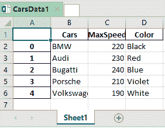

# 将熊猫数据帧导出到 Excel 文件

> 原文:[https://www . geesforgeks . org/export-a-pandas-data frame-to-a-excel-file/](https://www.geeksforgeeks.org/exporting-a-pandas-dataframe-to-an-excel-file/)

让我们看看如何将熊猫数据帧导出到 Excel 文件。

**算法:**

1.  创建数据帧。
2.  确定 Excel 文件的名称。
3.  用文件名调用**到 _excel()** 函数导出数据帧。

**例 1:**

## 蟒蛇 3

```
# importing the module
import pandas as pd

# creating the DataFrame
marks_data = pd.DataFrame({'ID': {0: 23, 1: 43, 2: 12,
                                 3: 13, 4: 67, 5: 89,
                                 6: 90, 7: 56, 8: 34},
                          'Name': {0: 'Ram', 1: 'Deep',
                                   2: 'Yash', 3: 'Aman',
                                   4: 'Arjun', 5: 'Aditya',
                                   6: 'Divya', 7: 'Chalsea',
                                   8: 'Akash' },
                          'Marks': {0: 89, 1: 97, 2: 45, 3: 78,
                                    4: 56, 5: 76, 6: 100, 7: 87,
                                    8: 81},
                          'Grade': {0: 'B', 1: 'A', 2: 'F', 3: 'C',
                                    4: 'E', 5: 'C', 6: 'A', 7: 'B',
                                    8: 'B'}})

# determining the name of the file
file_name = 'MarksData.xlsx'

# saving the excel
marks_data.to_excel(file_name)
print('DataFrame is written to Excel File successfully.')
```

**输出:**

```
DataFrame is written to Excel File successfully.
```

Excel 文件是:



**例 2:** 我们也可以先用 ExcelWriter()方法保存。

## 蟒蛇 3

```
# importing the module
import pandas as pd

# creating the DataFrame
cars_data = pd.DataFrame({'Cars': ['BMW', 'Audi', 'Bugatti', 
                                   'Porsche', 'Volkswagen'],
                          'MaxSpeed': [220, 230, 240, 210, 190],
                          'Color': ['Black', 'Red', 'Blue', 
                                    'Violet', 'White']})

# writing to Excel
datatoexcel = pd.ExcelWriter('CarsData1.xlsx')

# write DataFrame to excel
cars_data.to_excel(datatoexcel)

# save the excel
datatoexcel.save()
print('DataFrame is written to Excel File successfully.')
```

**输出:**

```
DataFrame is written to Excel File successfully.
```

