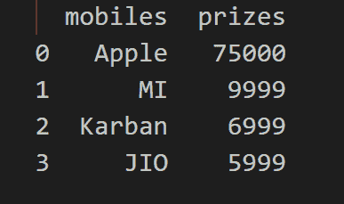

# 使用熊猫导出 DTA 文件。Python 中的 DataFrame.to_stata()函数

> 原文:[https://www . geesforgeks . org/export-DTA-file-use-pandas-data frame-to _ stata-function-in-python/](https://www.geeksforgeeks.org/exporting-dta-file-using-pandas-dataframe-to_stata-function-in-python/)

此方法用于将数据框写入 Stata 数据集文件。“dta”文件包含一个 Stata 数据集。DTA 文件是一个数据库文件，由 IWIS 链工程公司使用。

> **语法:** DataFrame.to_stata(路径，convert _ dates =无，write _ index =真，time _ stamp =无)
> 
> **参数:**
> 
> *   **路径:**字符串、缓冲区或路径对象
> *   **convert _ date:**dict
> *   **write_index :** bool
> *   **时间戳:**日期时间
> 
> **将:** DataFrame 对象返回到 Stata dta 格式。意味着回归。dta 文件。

**示例 1:** 创建 DTA 文件

在这里，我们将创建 dataframe，然后使用 DataFrame.to_stata()保存为 DTA 格式。

## 蟒蛇 3

```py
# importing package
import numpy
import pandas as pd

# create and view data
df = pd.DataFrame({
    'person': ["Rakesh", "Kishan", "Adesh", "Nitish"],
    'weight': [50, 60, 70, 80]
})
display(df)

# use pandas.DataFrame.to_stata method
# to extract .dta file
df.to_stata('person.dta')
```

**输出:**

 

**例 2:**

## 蟒蛇 3

```py
# importing package
import pandas as pd

# create and view data
df = pd.DataFrame({
    'mobiles': ["Apple", "MI", "Karban", "JIO"],
    'prizes': [75000, 9999, 6999, 5999]
})
display(df)

# use pandas.DataFrame.to_stata method
# to extract .dta file
df.to_stata('mobiles.dta')
```

**输出:**

 