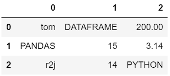

# 从熊猫的数据框中提取所有大写单词

> 原文:[https://www . geesforgeks . org/extract-all-大写-word-from-data frame-in-pandas/](https://www.geeksforgeeks.org/extract-all-capital-words-from-dataframe-in-pandas/)

在本文中，我们将讨论从 [*【熊猫】*](https://www.geeksforgeeks.org/pandas-tutorial/) 模块的数据帧中提取大写单词的各种方法。下面是将用于描述各种方法的数据框:

## 蟒蛇 3

```
# Import pandas library
import pandas

# Create dataset
data = [['tom', 'DATAFRAME', '200.00'],
        ['PANDAS', 15, 3.14],
        ['r2j', 14, 'PYTHON']]

# Create the pandas DataFrame
df = pandas.DataFrame(data)

# Display dataframe
df
```

**输出:**



**方法#1:** 在显式函数中使用[*order()*](https://www.geeksforgeeks.org/ord-function-python/)方法

创建一个显式函数来检查传递的字符串参数是否包含所有大写字符。在函数中，使用 ASCII 值检查每个字符是否是大写字母。现在在 dataframe 的每个元素上使用显式函数来识别大写单词并显示它们。

## 蟒蛇 3

```
# Import pandas library
import pandas

# explicit function to check if string
# contains only uppercase characters
def findCap(s):
    for ele in str(s):
        if ord(ele) < 65 or ord(ele) > 90:
            return 0
    return 1

# Create dataset
data = [['tom', 'DATAFRAME', '200.00'],
        ['PANDAS', 15, 3.14],
        ['r2j', 14, 'PYTHON']]

# Create the pandas DataFrame
df = pandas.DataFrame(data)

# access each element in
# the dataframe
for i in range(df.shape[1]):
    for ele in df[i]:

        # call explicit function
        if findCap(ele):
            print(ele)
```

**输出:**

```
PANDAS
DATAFRAME
PYTHON
```

**方法 2:** 使用 [*str()*](https://www.geeksforgeeks.org/python-str-function/) 和 [*isupper()*](https://www.geeksforgeeks.org/python-str-function/) 方法

访问数据框的每个元素，并使用*str()*将每个元素转换为字符串，然后对每个元素应用 *isupper()* 方法。从数据框中提取大写单词并显示出来。

## 蟒蛇 3

```
# Import pandas library
import pandas

# Create dataset
data = [['tom', 'DATAFRAME', '200.00'],
        ['PANDAS', 15, 3.14],
        ['r2j', 14, 'PYTHON']]

# Create the pandas DataFrame
df = pandas.DataFrame(data)

# access each element in the dataframe
for i in range(df.shape[1]):
   for ele in df[i]:

       # use isupper()
       if str(ele).isupper():
            print(ele)
```

**输出:**

```
PANDAS
DATAFRAME
PYTHON
```

**方法#3:** 使用 [*str()*](https://www.geeksforgeeks.org/python-str-function/) 方法和 [*regex*](https://www.geeksforgeeks.org/python-regex/) 模块

访问数据帧的每个元素，并使用 *str()，*将每个元素转换为字符串，然后应用*正则表达式*从数据帧中提取大写单词并显示。

## 蟒蛇 3

```
# Import required modules
import re
import pandas

# Create dataset
data = [['tom', 'DATAFRAME', '200.00'],
        ['PANDAS', 15, 3.14],
        ['r2j', 14, 'PYTHON']]

# Create the pandas DataFrame
df = pandas.DataFrame(data)

# access each element in the dataframe
for i in range(df.shape[1]):
   for ele in df[i]:
        if bool(re.match(r'\w*[A-Z]\w*', str(ele))):
              print(ele)
```

**输出:**

```
PANDAS
DATAFRAME
PYTHON
```