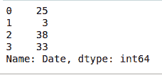
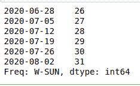
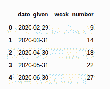

# 从熊猫-蟒蛇的日期中提取周数

> 原文:[https://www . geesforgeks . org/extract-week-number-from-date-in-pandas-python/](https://www.geeksforgeeks.org/extract-week-number-from-date-in-pandas-python/)

很多时候，当处理一些包含日期的数据时，我们可能需要从一个特定的日期中提取周数。在 Python 中，可以在熊猫的帮助下轻松完成。

**例 1:**

```py
# importing pandas as pd
import pandas as pd 

# creating a dictionary containing a date
dict = {'Date':["2015-06-17"]}

# converting the dictionary to a dataframe
df = pd.DataFrame.from_dict(dict)

# converting the date to the required format
df['Date'] = pd.to_datetime(df['Date'], errors ='coerce')
df.astype('int64').dtypes

# extracting the week from the date
weekNumber = df['Date'].dt.week

print(weekNumber)
```

**输出:**

```py
0    25
Name: Date, dtype: int64
```

**示例 2:** 我们也可以通过在‘Date’对象中添加更多的日期来对多个日期进行同样的操作。

```py
# importing pandas as pd
import pandas as pd 

# creating a dictionary containing a date
dict = {'Date':["2020-06-17", "2020-01-14", 
                "2020-09-20", "2020-08-15"]}

# converting the dictionary to a 
# dataframe
df = pd.DataFrame.from_dict(dict)

# converting the date to the required 
# format
df['Date'] = pd.to_datetime(df['Date'],
                            errors ='coerce')
df.astype('int64').dtypes

# extracting the week from the date
weekNumber = df['Date'].dt.week

print(weekNumber)
```

**输出:**



**示例 3:** 使用 **date_range()** 和 **to_series()** 从多个日期的日期中提取周数。

*   **pandas.data_range():** It generates all the dates from the start to end date

    **语法:**

    > pandas.date_range(开始、结束、句点、freq、tz、normalize、name、closed)

*   **pandas.to_series():** It creates a Series with both index and values equal to the index keys.

    **语法:**

    ```py
    Index.to_series(self, index, name)
    ```

```py
# importing pandas as pd
import pandas as pd 

# generating all dates in given range
# with increment by days
allDates = pd.date_range('2020-06-27', '2020-08-03', freq ='W')

# converting dates to series
series = allDates.to_series()

series.dt.week
```

**输出:**



**例 4:** 在本例中，我们将使用**熊猫。Series()** 生成日期，并使用不同的方式将该系列转换为数据框。

**熊猫。Series():** 用于创建带有轴标签的一维数组。
**语法:**

```py
pandas.Series(data, index, dtype, name, copy, fastpath)
```

```py
# importing pandas as pd
import pandas as pd 

# generating the series
dates = pd.Series(pd.date_range('2020-2-10',
                                periods = 5,
                                freq ='M'))

# converting to dataframe
df = pd.DataFrame({'date_given': dates})

# extracting the week number
df['week_number'] = df['date_given'].dt.week

df
```

**输出:**

