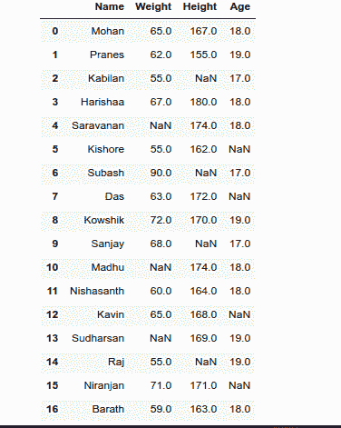
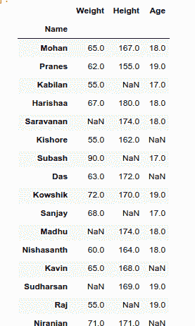
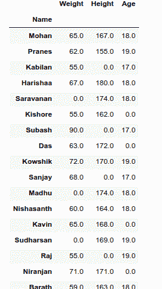
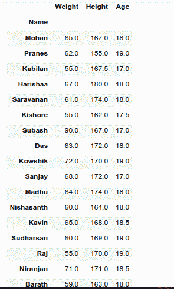

# 填充空栏–熊猫

> 原文:[https://www.geeksforgeeks.org/fill-empty-column-pandas/](https://www.geeksforgeeks.org/fill-empty-column-pandas/)

有时，数据框包含一个空列，可能会在现实生活场景中造成真正的问题。缺失数据也可以指熊猫的 NA(不可用)值。在数据框中，有时许多数据集只是缺少数据，要么是因为它存在而没有被收集，要么是因为它从未存在过。在本文中，让我们看看如何使用熊猫填充[数据框](https://www.geeksforgeeks.org/python-pandas-dataframe/)中的空列。

**注:**CSV 文件的链接[在此。](https://docs.google.com/spreadsheets/d/1eDFL022sRMJW9onVuM6zGnngKVSg-FvVsC7o0fqcKn0/edit?usp=sharing)

**填充空栏:**

## 蟒蛇 3

```py
import pandas as pd
df = pd.read_csv("Persons.csv")
df
```

首先，我们导入熊猫，然后在 df 变量中加载我们的 CSV 文件。试着在 jupyter 笔记本或 colab 上运行这个。

**输出:**



## 蟒蛇 3

```py
df.set_index('Name ', inplace=True)
df
```

这一行用来删除索引值，我们不希望这样，所以我们删除它。

**输出:**



有几种方法用来填充空列。我们将逐一查看

**方法 1:**

在这个方法中，我们将使用“df.fillna(0)”，它用 0 替换所有的 NaN 元素。

**示例:**

## 蟒蛇 3

```py
df1 = df.fillna(0)
df1
```

**输出:**



**方法二:**

在这个方法中，我们将使用“df.fillna(method='ffill ')”，用于向前或向后传播非空值。

> **语法:**data frame . fill na(*值=None* 、 *方法=None* 、 *轴=None* 、*in place = False*、 *极限=None* 、 *下变频=None*

## 蟒蛇 3

```py
df2 = df.fillna(method='ffill')
df2
```

**输出:**


**方法 3:**

在这个方法中，我们将使用“df.interpolate()”

> **语法:**data frame . interpole(*法='linear'* 、 *轴=0* 、 *极限=无* 、 *在位=假* 、 *极限 _ 方向=无* 、 *极限 _ 面积=无*、

## 蟒蛇 3

```py
df3 = df.interpolate()
df3
```

**输出:**

