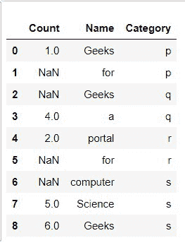
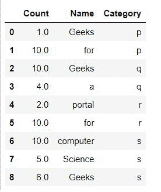
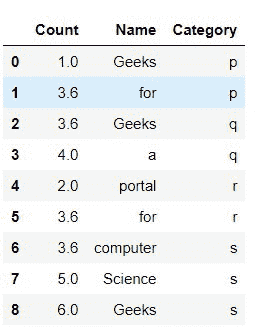
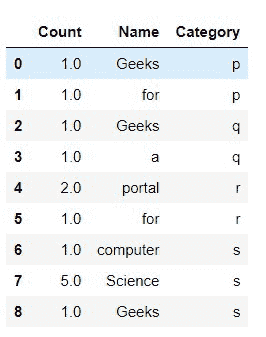

# 菲尔娜在巨蟒熊猫中多列就位

> 原文:[https://www . geesforgeks . org/fill na-in-multi-columns-in-in-python-pandas/](https://www.geeksforgeeks.org/fillna-in-multiple-columns-in-place-in-python-pandas/)

在本文中，我们将使用 pandas 库编写 python 脚本来填充 Python 中的多列。数据框是一种 2D 数据结构，可以存储在 CSV、Excel、。数据库，SQL 格式。我们将使用 python 熊猫库来填充数据框中缺失的值。

**让我们通过实现来理解这一点:**

首先用熊猫创建数据集

## 蟒蛇 3

```py
# Importing Required Libraries
import pandas as pd
import numpy as np

# Creating a sample dataframe with NaN values
dataframe = pd.DataFrame({'Count': [1, np.nan,
                                    np.nan, 4,
                                    2, np.nan,
                                    np.nan, 5, 6],

    'Name': ['Geeks','for', 'Geeks','a','portal','for',
             'computer', 'Science','Geeks'],
                          'Category':list('ppqqrrsss')})

# Printing The dataframe
display(dataframe)
```

**输出:**



**示例 1:用固定值填充缺失的列值:**

我们可以使用 fillna()函数将数据框中缺失的值归入由值字典定义的每一列。这种方法的局限性在于，我们只能使用常量值来填充。

## 蟒蛇 3

```py
# Importing Required Libraries
import pandas as pd
import numpy as np

# Creating a sample dataframe with NaN values
dataframe = pd.DataFrame({'Count': [1, np.nan, np.nan, 4, 2,
                                    np.nan,np.nan, 5, 6],

    'Name': ['Geeks','for', 'Geeks','a','portal','for',
             'computer', 'Science','Geeks'],
                          'Category':list('ppqqrrsss')})

# Creating a constant value for column Count
constant_values = {'Count': 10}
dataframe = dataframe.fillna(value = constant_values)

# Printing the dataframe
display(dataframe)
```

**输出:**



**示例 2:用平均值()填充缺失的列值:**

在这种方法中，值由一种称为**平均值()**的方法定义，该方法找出给定列的现有值的平均值，然后估算每个缺失(NaN)值的平均值。

## 蟒蛇 3

```py
# Importing Required Libraries
import pandas as pd
import numpy as np

# Creating a sample dataframe with NaN values
dataframe = pd.DataFrame({'Count': [1, np.nan, np.nan, 4, 2,
                                    np.nan,np.nan, 5, 6],

    'Name': ['Geeks','for', 'Geeks','a','portal','for',
             'computer', 'Science','Geeks'],
                          'Category':list('ppqqrrsss')})

# Filling Count column with mean of Count column
dataframe.fillna(dataframe['Count'].mean(), inplace = True)

# Printing the Dataframe
display(dataframe)
```

输出:



**示例 3:用模式()填充缺失的列值。**

模式是一组数据值中最常出现的值。如果 X 是一个离散的随机变量，模式就是概率质量函数取其最大值的值 X。换句话说，它是最有可能被采样的值。

## 蟒蛇 3

```py
# Importing Required Libraries
import pandas as pd
import numpy as np

# Creating a sample dataframe with NaN values
dataframe = pd.DataFrame({'Count': [1, np.nan, np.nan,
                                    1, 2, np.nan,np.nan,
                                    5, 1],

    'Name': ['Geeks','for', 'Geeks','a','portal','for',
             'computer', 'Science','Geeks'],
                          'Category':list('ppqqrrsss')})

# Using Mode() function to impute the values using fillna
dataframe.fillna(dataframe['Count'].mode()[0], inplace = True)

# Printing the Dataframe
display(dataframe)
```

**输出:**



。