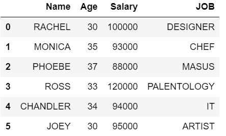
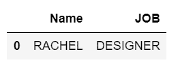
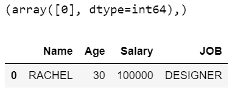

# 用多种条件过滤熊猫数据帧

> 原文:[https://www . geesforgeks . org/filter-pandas-data frame-with-multi-conditions/](https://www.geeksforgeeks.org/filter-pandas-dataframe-with-multiple-conditions/)

在本文中，让我们讨论如何过滤熊猫数据帧与多个条件。在整个软件开发过程中，有可能在多种条件下从熊猫数据框中过滤数据。原因是 dataframe 可能有多列和多行。有选择地显示有限行的列总是用户期望的视图。为了满足用户的期望，同时也有助于机器深度学习场景，对熊猫数据帧进行多条件过滤是非常必要的。

让我们看看做同样事情的不同方法。

创建一个示例数据帧以继续

## 蟒蛇 3

```py
# import module
import pandas as pd

# assign data
dataFrame = pd.DataFrame({'Name': [' RACHEL  ', ' MONICA  ', ' PHOEBE  ',
                                   '  ROSS    ', 'CHANDLER', ' JOEY    '],

                          'Age': [30, 35, 37, 33, 34, 30],

                          'Salary': [100000, 93000, 88000, 120000, 94000, 95000],

                          'JOB': ['DESIGNER', 'CHEF', 'MASUS', 'PALENTOLOGY',
                                  'IT', 'ARTIST']})

# display dataframe
display(dataFrame)
```

**输出:**



**方法 1:使用 loc**

在这里，我们将获得薪资大于或等于 100000 且年龄< 40 and their JOB starts with ‘D’ from the dataframe. Print the details with Name and their JOB. For the above requirement, we can achieve this by using **锁定**的所有行。它用于通过标签或布尔数组访问单个或多个行和列。loc 使用列标签和索引。

## 蟒蛇 3

```py
# import module
import pandas as pd

# assign data
dataFrame = pd.DataFrame({'Name': [' RACHEL  ', ' MONICA  ', ' PHOEBE  ',
                                   '  ROSS    ', 'CHANDLER', ' JOEY    '],

                          'Age': [30, 35, 37, 33, 34, 30],

                          'Salary': [100000, 93000, 88000, 120000, 94000, 95000],

                          'JOB': ['DESIGNER', 'CHEF', 'MASUS', 'PALENTOLOGY',
                                  'IT', 'ARTIST']})
# filter dataframe
display(dataFrame.loc[(dataFrame['Salary']>=100000) & (dataFrame['Age']< 40) & (dataFrame['JOB'].str.startswith('D')),
                    ['Name','JOB']])
```

**输出:**



输出解析给定的条件，最后，我们将只显示 2 列，即名称和作业。

**方法二:使用 NumPy**

这里将获得所有薪资大于或等于 100000 且年龄小于 40 的行，它们的职务从数据框中的“D”开始。我们需要使用 NumPy。

## 蟒蛇 3

```py
# import module
import pandas as pd
import numpy as np

# assign data
dataFrame = pd.DataFrame({'Name': [' RACHEL  ', ' MONICA  ', ' PHOEBE  ',
                                   '  ROSS    ', 'CHANDLER', ' JOEY    '],

                          'Age': [30, 35, 37, 33, 34, 30],

                          'Salary': [100000, 93000, 88000, 120000, 94000, 95000],

                          'JOB': ['DESIGNER', 'CHEF', 'MASUS', 'PALENTOLOGY',
                                  'IT', 'ARTIST']})

# filter dataframe                                   
filtered_values = np.where((dataFrame['Salary']>=100000) & (dataFrame['Age']< 40) & (dataFrame['JOB'].str.startswith('D')))
print(filtered_values)
display(dataFrame.loc[filtered_values])
```

**输出:**



在上例中， *print(filtered_values)* 将输出为*(数组([0]，dtype=int64)，)*，表示索引值为 0 的第一行将是输出。之后，输出将有一行所有的列，并根据给定的条件进行检索。

**方法 3:使用查询(评估和查询仅适用于列)**

在这种方法中，我们得到所有薪资小于或等于 100000 且年龄小于 40 的行，它们的作业从数据框中的“C”开始。它只是用一个或多个布尔表达式来查询数据帧的列，如果有多个，则在中间有& condition。

## 蟒蛇 3

```py
# import module
import pandas as pd

# assign data
dataFrame = pd.DataFrame({'Name': [' RACHEL  ', ' MONICA  ', ' PHOEBE  ',
                                   '  ROSS    ', 'CHANDLER', ' JOEY    '],

                          'Age': [30, 35, 37, 33, 34, 30],

                          'Salary': [100000, 93000, 88000, 120000, 94000, 95000],

                          'JOB': ['DESIGNER', 'CHEF', 'MASUS', 'PALENTOLOGY',
                                  'IT', 'ARTIST']})

# filter dataframe 
display(dataFrame.query('Salary  <= 100000 & Age < 40 & JOB.str.startswith("C").values'))
```