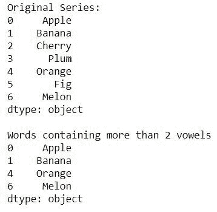
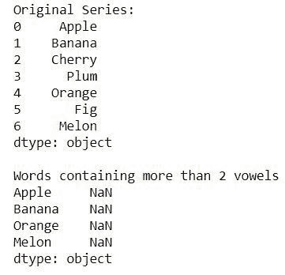

# 过滤给定熊猫系列中包含至少两个元音的单词

> 原文:[https://www . geeksforgeeks . org/filter-words-from-a-给定-pandas-series-包含至少两个元音的单词/](https://www.geeksforgeeks.org/filter-words-from-a-given-pandas-series-that-contain-atleast-two-vowels/)

在这篇文章中，我们如何从给定的包含两个或更多元音的系列中过滤单词。在这里，我们将看到实现这一目标的两种方法。
**示例 1:**
在本例中，我们将使用 **map()** 函数循环遍历系列，并检查每个单词的元音计数是否大于或等于 2。**映射**基本用于循环遍历系列，**计数器**用于统计每个单词中元音的个数。

## 蟒蛇 3

```py
import pandas as pd
from collections import Counter

# creating a series of words
series = pd.Series(['Apple', 'Banana', 'Cherry',
                    'Plum', 'Orange', 'Fig', 'Melon'])

print("Original Series:")
print(series)
print("\nWords containing atleast 2 vowels")

# mapping through the series and checking if count of vowels is >=2
result = series.map(lambda c: sum([Counter(c.lower()).get(i, 0)
                                   for i in list('aeiou')]) >= 2)

print(series[result])
```

**输出:**



**示例 2:**
在本例中，我们将使用带有 regex 的 **Series.str.count()** 函数循环遍历该系列，并检查每个单词的元音计数是否大于或等于 2。**(？i)** 用于启动不区分大小写模式，将大写字符转换为小写字符。我们需要将大写字符转换为小写字符，因为对于元音，我们正在与小写元音进行比较，因此每当大写元音像在 **Apple** 中出现时，我们需要将**‘A’**转换为小写以便正确比较。

## 蟒蛇 3

```py
import pandas as pd
from collections import Counter

# creating a series of words
series = pd.Series(['Apple', 'Banana', 'Cherry',
                    'Plum', 'Orange', 'Fig', 'Melon'])

print("Original Series:")
print(series)
print("\nWords containing atleast 2 vowels")

# mapping through the series and checking
# if count of vowels is >=2
result = series[series.str.count('(?i)[aeiou]') >=2]

print(series[result])
```

**输出:**

