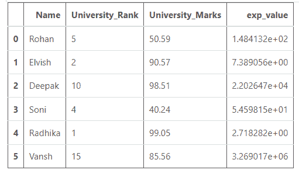
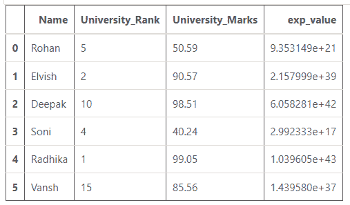

# 在熊猫-Python 中找到一列的指数

> 原文:[https://www . geeksforgeeks . org/find-熊猫柱指数-python/](https://www.geeksforgeeks.org/find-exponential-of-a-column-in-pandas-python/)

让我们看看如何在[熊猫数据框](https://www.geeksforgeeks.org/python-pandas-dataframe/)中找到一列的指数。首先，让我们创建一个数据框架:

## 蟒蛇 3

```
# importing pandas and
# numpy libraries
import pandas as pd
import numpy as np

# creating and initializing a list
values= [ ['Rohan', 5, 50.59], ['Elvish', 2, 90.57],
         ['Deepak', 10, 98.51], ['Soni', 4, 40.24],
         ['Radhika', 1, 99.05], ['Vansh', 15, 85.56] ]

# creating a pandas dataframe
df = pd.DataFrame(values, columns = ['Name',
                                     'University_Rank',
                                     'University_Marks'])

# displaying the data frame
df
```

**输出:**


利用[**numpy . exp()**](https://www.geeksforgeeks.org/numpy-exp-python/)**函数求出任意一列的指数。该函数计算输入数组/序列的指数。**

> ****语法:** numpy.exp(数组，out = None，其中= True，casting = 'same_kind '，order = 'K '，dtype = None)** 
> 
>  ****返回:**输入数组/序列中所有元素指数的数组。**

****例 1:** 求单列的指数(整数值)。**

## **蟒蛇 3**

```
# importing pandas and
# numpy libraries
import pandas as pd
import numpy as np

# creating and initializing a list
values= [ ['Rohan', 5, 50.59], ['Elvish', 2, 90.57],
         ['Deepak', 10, 98.51], ['Soni', 4, 40.24],
         ['Radhika', 1, 99.05], ['Vansh', 15, 85.56] ]

# creating a pandas dataframe
df = pd.DataFrame(values, columns = ['Name',
                                     'University_Rank',
                                     'University_Marks'])

# finding the exponential value
# of column using np.exp() function
df['exp_value'] = np.exp(df['University_Rank'])

# displaying the data frame
df
```

****输出:****

****

****例 2:** 求单列的指数(浮点值)。**

## **蟒蛇 3**

```
# importing pandas and
# numpy libraries
import pandas as pd
import numpy as np

# creating and initializing a list
values= [ ['Rohan', 5, 50.59], ['Elvish', 2, 90.57],
         ['Deepak', 10, 98.51], ['Soni', 4, 40.24],
         ['Radhika', 1, 99.05], ['Vansh', 15, 85.56] ]

# creating a pandas dataframe
df = pd.DataFrame(values, columns = ['Name',
                                     'University_Rank',
                                     'University_Marks'])

# finding the exponential value
# of column  using np.exp() function
df['exp_value'] = np.exp(df['University_Marks'])

# displaying the data frame
df
```

****输出:****

****