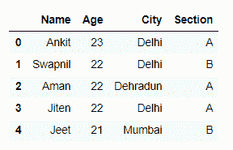
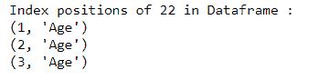
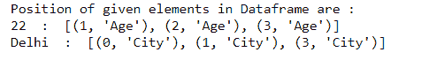

# 在 Python 中找到熊猫数据框中元素的位置

> 原文:[https://www . geesforgeks . org/find-熊猫元素的位置-python 中的数据框/](https://www.geeksforgeeks.org/find-location-of-an-element-in-pandas-dataframe-in-python/)

在本文中，我们将看到如何使用用户定义的函数找到数据框中元素的位置。让我们首先用一个列表字典创建一个简单的数据框，比如列名是:“名称”、“年龄”、“城市”和“部分”。

## 蟒蛇 3

```py
# Import pandas library
import pandas as pd

# List of tuples
students = [('Ankit', 23, 'Delhi', 'A'),
            ('Swapnil', 22, 'Delhi', 'B'),
            ('Aman', 22, 'Dehradun', 'A'),
            ('Jiten', 22, 'Delhi', 'A'),
            ('Jeet', 21, 'Mumbai', 'B')
            ]

# Creating Dataframe object
df = pd.DataFrame(students, columns =['Name', 'Age', 'City', 'Section'])

df
```

**输出:**



**示例 1 :** 找到数据框中元素的位置。

## 蟒蛇 3

```py
# Import pandas library
import pandas as pd

# List of tuples
students = [('Ankit', 23, 'Delhi', 'A'),
            ('Swapnil', 22, 'Delhi', 'B'),
            ('Aman', 22, 'Dehradun', 'A'),
            ('Jiten', 22, 'Delhi', 'A'),
            ('Jeet', 21, 'Mumbai', 'B')
            ]

# Creating Dataframe object
df = pd.DataFrame(students, columns =['Name', 'Age', 'City', 'Section'])

# This function will return a list of
# positions where element exists
# in the dataframe.
def getIndexes(dfObj, value):

    # Empty list
    listOfPos = []

    # isin() method will return a dataframe with
    # boolean values, True at the positions   
    # where element exists
    result = dfObj.isin([value])

    # any() method will return
    # a boolean series
    seriesObj = result.any()

    # Get list of column names where
    # element exists
    columnNames = list(seriesObj[seriesObj == True].index)

    # Iterate over the list of columns and
    # extract the row index where element exists
    for col in columnNames:
        rows = list(result[col][result[col] == True].index)

        for row in rows:
            listOfPos.append((row, col))

    # This list contains a list tuples with
    # the index of element in the dataframe
    return listOfPos

# Calling getIndexes() function to get
# the index positions of all occurrences
# of 22 in the dataframe
listOfPositions = getIndexes(df, 22)

print('Index positions of 22 in Dataframe : ')

# Printing the position
for i in range(len(listOfPositions)):
    print( listOfPositions[i])
```

**输出:**



现在让我们理解函数 getIndexes()是如何工作的。 [isin()](https://www.geeksforgeeks.org/python-pandas-dataframe-isin/) 、 [dataframe/series.any()](https://www.geeksforgeeks.org/python-pandas-series-dataframe-any/) ，接受值并返回一个带有布尔值的 dataframe。该布尔数据帧的大小与第一个原始数据帧的大小相似。如果数据框中存在给定元素，则该值为真，否则为假。然后找到包含元素 22 的列的名称。我们可以通过获取包含 True 的布尔数据框中的列名来实现这一点。现在，在布尔数据框中，我们遍历每一个选定的列，对于每一列，我们找到带有 True 的行。现在，这些列名和行索引的组合(如果存在 True)就是数据框中的索引位置 22。这就是 getIndexes()如何建立给定元素的精确索引位置&以(行，列)元组的形式存储每个位置。最后，它返回一个元组列表，表示它在数据帧中的索引位置。
**示例 2:** 查找数据框中多个元素的位置。

## 蟒蛇 3

```py
# Import pandas library
import pandas as pd

# List of tuples
students = [('Ankit', 23, 'Delhi', 'A'),
            ('Swapnil', 22, 'Delhi', 'B'),
            ('Aman', 22, 'Dehradun', 'A'),
            ('Jiten', 22, 'Delhi', 'A'),
            ('Jeet', 21, 'Mumbai', 'B')
            ]

# Creating Dataframe object
df = pd.DataFrame(students, columns =['Name', 'Age', 'City', 'Section'])

# This function will return a
# list of positions where
# element exists in dataframe
def getIndexes(dfObj, value):

    # Empty list
    listOfPos = []

    # isin() method will return a dataframe with
    # boolean values, True at the positions   
    # where element exists
    result = dfObj.isin([value])

    # any() method will return
    # a boolean series
    seriesObj = result.any()

    # Get list of columns where element exists
    columnNames = list(seriesObj[seriesObj == True].index)

    # Iterate over the list of columns and
    # extract the row index where element exists
    for col in columnNames:
        rows = list(result[col][result[col] == True].index)

        for row in rows:
            listOfPos.append((row, col))

    # This list contains a list tuples with
    # the index of element in the dataframe
    return listOfPos

# Create a list which contains all the elements
# whose index position you need to find
listOfElems = [22, 'Delhi']

# Using dictionary comprehension to find
# index positions of multiple elements
# in dataframe
dictOfPos = {elem: getIndexes(df, elem) for elem in listOfElems}

print('Position of given elements in Dataframe are : ')

# Looping through key, value pairs
# in the dictionary
for key, value in dictOfPos.items():
    print(key, ' : ', value)
```

**输出:**

