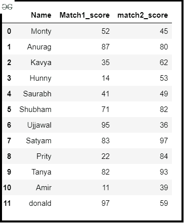
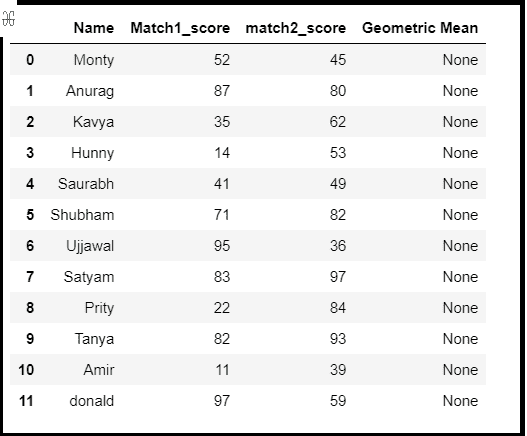
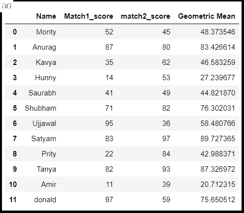

# 找到给定熊猫数据帧的几何平均值

> 原文:[https://www . geeksforgeeks . org/find-给定熊猫的几何平均值-dataframe/](https://www.geeksforgeeks.org/find-the-geometric-mean-of-a-given-pandas-dataframe/)

在本文中，我们将讨论如何找到给定数据帧的几何平均值。一般来说，第 n 个<sup>数的几何平均数是它们乘积的第 n 个根。</sup>


可以使用 [scipy.stats.gmean()](https://www.geeksforgeeks.org/scipy-stats-gmean-function-python/) 方法找到。该函数计算数组元素沿数组指定轴的几何平均值(python 中的列表)。

**语法:**

```py
scipy.stats.gmean(array, axis=0, dtype=None)
```

**进场:**

*   导入模块
*   创建熊猫数据框
*   为几何平均值创建一个新列
*   用 scipy.stats.gmean()求几何平均值
*   存储到新列中
*   显示数据帧

**分步实施:**

**步骤 1:** 导入模块并制作数据框。

## 计算机编程语言

```py
# importing module
import pandas as pd
import numpy as np
from scipy import stats

# Create a DataFrame
df = pd.DataFrame({
    'Name': ['Monty', 'Anurag', 'Kavya', 'Hunny', 'Saurabh',
             'Shubham', 'Ujjawal', 'Satyam', 'Prity', 'Tanya', 
             'Amir', 'donald'],
    'Match1_score': [52, 87, 35, 14, 41, 71, 95, 83, 22, 82, 11, 97],
    'match2_score': [45, 80, 62, 53, 49, 82, 36, 97, 84, 93, 39, 59]})

# Display DataFrame
df
```

**输出:**



**步骤 2:** 创建一个空的数据框列。

## 蟒蛇 3

```py
# Creating empty column in DataFrame
df['Geometric Mean'] = None
df
```

**输出:**



**第三步:**用 scipy.stats.gmean()找到几何平均值，并将其存储到新列中。

## 蟒蛇 3

```py
# Computing geometric mean
# Storing into a DataFrame column
df['Geometric Mean'] = stats.gmean(df.iloc[:, 1:3], axis=1)
df
```

**输出:**

