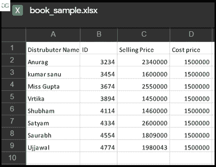
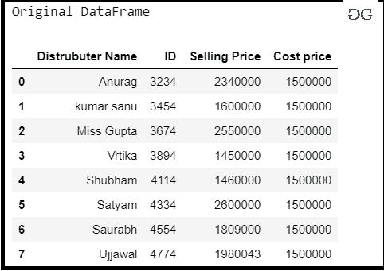
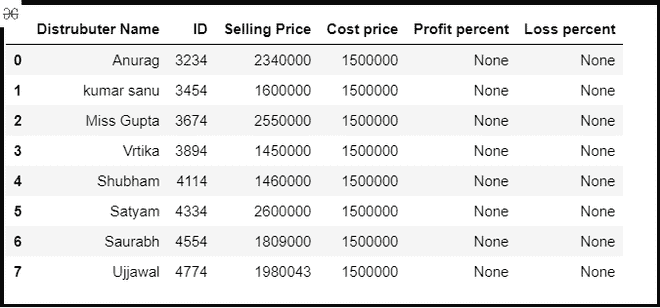
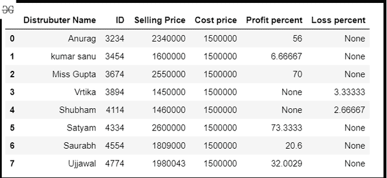

# 使用熊猫

在给定的 Excel 表格中找出盈亏百分比

> 原文:[https://www . geeksforgeeks . org/查找给定工作表中的损益百分比使用熊猫/](https://www.geeksforgeeks.org/find-the-profit-and-loss-percent-in-the-given-excel-sheet-using-pandas/)

在这些文章中，让我们讨论如何从 Excel 文件中提取数据，并找到给定数据的利润百分比和亏损百分比。假设我们的 Excel 文件看起来像这样，那么我们必须从列中提取销售价格和成本价，找到利润百分比和亏损百分比，并将其存储到新的数据框列中。



要获取上面使用的 excel 文件，点击这里的[。](https://drive.google.com/file/d/1HNlNTcOL9XY_amMMj4PuRT5D7oeHsZmG/view?usp=sharing)

**那么，我们来讨论一下方法:**

**第一步:**导入所需模块，从 excel 读取数据。

## 蟒蛇 3

```py
# importing module

import pandas as pd

# Creating df
# Reading data from Excel
data = pd.read_excel("excel_work/book_sample.xlsx")
print("Original DataFrame")
data
```

**输出:**



**步骤 2:** 在数据框中为商店利润百分比和损失百分比创建一个新列。

## 蟒蛇 3

```py
# Create column for profit and loss
data['Profit percent']= None
data['Loss percent'] = None
data
```

**输出:**



**第三步:**设置销售价格、成本价、利润百分比和亏损百分比的指标。

## 蟒蛇 3

```py
# set index
index_selling = data.columns.get_loc('Selling Price')
index_cost = data.columns.get_loc('Cost price')
index_profit = data.columns.get_loc('Profit percent')
index_loss = data.columns.get_loc('Loss percent')

print(index_selling, index_cost, index_profit, index_loss)
```

**输出:**

```py
2 3 4 5

```

**第四步:**根据各列指标计算盈亏百分比。

```py
profit = (SP) - (CP)
profit % = (profit/ CP × 100)%
Loss = (CP) - (SP)
Loss % = (loss/ CP × 100)%
```

## 蟒蛇 3

```py
# Loop for accessing every index in DataFrame
# and compute Profit % and loss %
# and store into new column in DataFrame
for row in range(0, len(data)):
    if data.iat[row, index_selling] > data.iat[row, index_cost]:
        profit = data.iat[row, index_selling] - data.iat[row, index_cost]
        data.iat[row, index_profit] = (profit/data.iat[row, index_cost]*100)

    else:
        loss = abs(data.iat[row, index_cost]-data.iat[row, index_selling])
        data.iat[row, index_loss] = (loss/data.iat[row, index_cost]*100)

data
```

**输出:**

