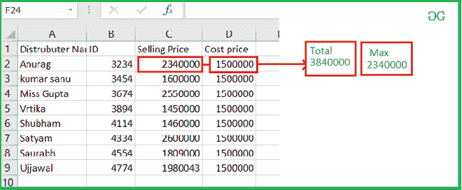
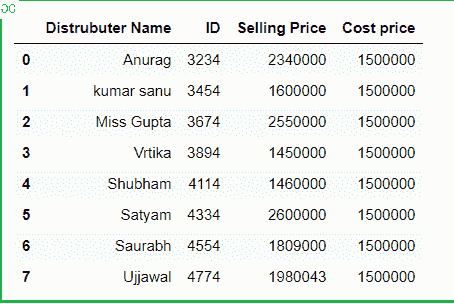
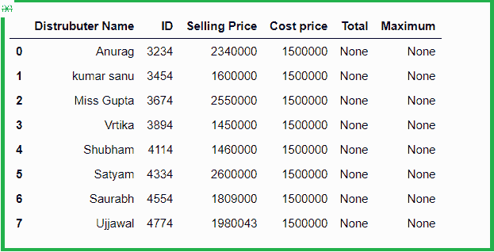
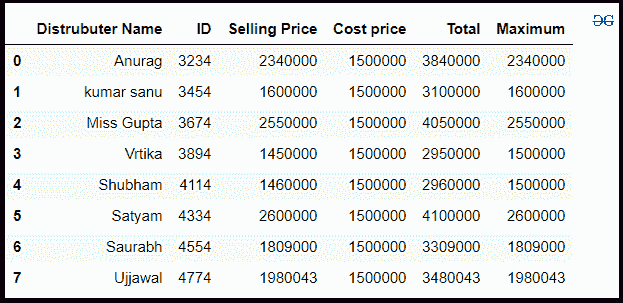

# 用熊猫

求 excel 文件中两列的总和和最大值

> 原文:[https://www . geeksforgeeks . org/查找 excel 文件中两列的总和和最大值使用熊猫/](https://www.geeksforgeeks.org/find-the-sum-and-maximum-value-of-the-two-column-in-excel-file-using-pandas/)

在这些文章中，我们将讨论如何从 excel 中读取数据并执行一些数学运算，然后将其存储到 DataFrame 中的新列中。假设我们的 excel 文件是这样的。



sample_data.xlsx

然后我们必须计算两列之和，找出最大值，并存储到新的 DataFrame 列中。

**进场:**

*   导入熊猫模块。
*   从 Excel 中读取数据。
*   创建一个新列来存储总和和最大值。
*   设置用于访问元素的每一列的索引。
*   将两列之和存储在新列中。
*   并将两列中的最大值存储在一列中。
*   显示数据帧。

**第一步:**导入模块，从 excel 中读取。

## 蟒蛇 3

```py
# import module
import pandas as pd

# read from excel
# and store in a DataFrame
df = pd.read_excel('excel_work/book_sample.xlsx')
df
```

**输出:**



**步骤 2:** 创建一个新列来存储 sum 和 max

## 蟒蛇 3

```py
# creation new column
df['Total'] = None
df['Maximum'] = None
df
```

**输出:**



**步骤 3:** 设置访问所需列的索引。

## 蟒蛇 3

```py
# Set index for each column
index_selling=df.columns.get_loc('Selling Price')
index_cost=df.columns.get_loc('Cost price')
index_total=df.columns.get_loc('Total')
index_max=df.columns.get_loc('Maximum')

print(index_selling,index_cost,index_total,index_max)
```

**输出:**

```py
2 3 4 5
```

**第 4 步:**选择每一行，添加一列，找到最大值

## 蟒蛇 3

```py
for row in range(0, len(df)):
    df.iat[row, index_total] = df.iat[row,
                                      index_selling] + df.iat[row, index_cost]

    if df.iat[row, index_selling] > df.iat[row, index_cost]:
        df.iat[row, index_max] = df.iat[row, index_selling]
    else:
        df.iat[row, index_max] = df.iat[row, index_cost]
df
```

**输出:**

