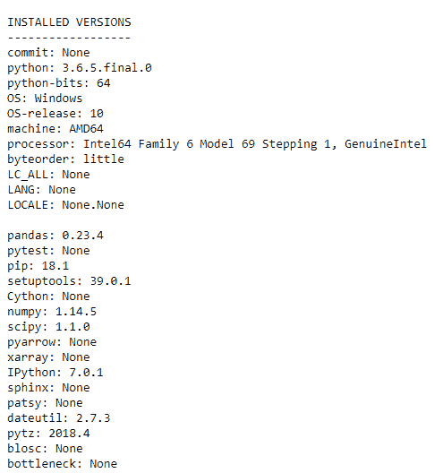

# 找到熊猫的版本及其依赖

> 原文:[https://www . geesforgeks . org/find-the-version-of-the-pandas-and-it-dependencies/](https://www.geeksforgeeks.org/find-the-version-of-the-pandas-and-its-dependencies/)

熊猫是 Python 中最重要的数据分析包之一，这意味着熊猫版本的频繁更新。这导致了与熊猫的其他依赖关系的兼容性问题。让我们讨论检查熊猫版本及其在任何系统上运行的依赖关系的方法。

**找到熊猫在任何系统上运行的版本。**

我们可以使用`pd.__version__`检查熊猫在任何系统上运行的版本。

```py
# importing pandas as pd
import pandas as pd

# Check the version
print(pd.__version__)
```

**输出:**


**找到任何系统上运行的熊猫给定版本的依赖版本。**

我们可以使用实用函数`pd.show_versions()`来检查依赖项的版本。

```py
# importing pandas as pd
import pandas as pd

# Check the version of the dependencies
pd.show_versions()
```

**输出:**
