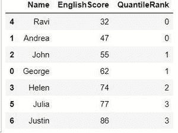
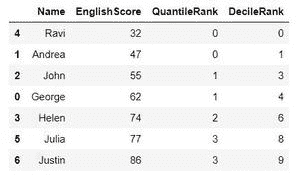

# 寻找熊猫数据框列的分位数和十分位数

> 原文:[https://www . geesforgeks . org/find-熊猫的分位数和十分位数-dataframe-column/](https://www.geeksforgeeks.org/finding-the-quantile-and-decile-ranks-of-a-pandas-dataframe-column/)

分位数是指样本被分成大小相等的相邻子组。

中位数是分位数；中值被置于概率分布中，这样正好一半的数据低于中值，一半的数据高于中值。中位数把一个分布分成两个相等的区域，所以它有时被称为 2 分位数。

四分位数也是分位数；他们把分配分成四等份。

百分位数是将分布分成 100 等份的分位数，十分位数是将分布分成 10 等份的分位数。

我们可以用下面的公式来估算第 i <sup>次</sup>观测值:

```
ith observation = q (n + 1)
```

其中 **q** 是分位数，低于你要找的**I<sup>th</sup>T5】值的比例**

**n** 是数据集中的项目数。

因此，为了找到分位数排名，q 应该是 0.25，因为我们希望将数据集分成 4 个相等的部分，并根据它们落在哪个四分位数对 0-3 的值进行排名。

同样，对于十分位数，q 应该是 0.1，因为我们希望我们的数据集被分成 10 个相等的部分。

在转向熊猫之前，让我们通过一个例子来尝试上面的概念，以了解我们的分位数和十分位数是如何计算的。

**样题:**在下面的一组数据中找到这个数字，其中 25%的数值低于它，75%的数值高于它。

**数据:** 32、47、55、62、74、77、86

第一步:将数据从最小到最大排序。问题中的数据已经按升序排列。

第二步:计算你的数据集中有多少个观察值。这个特殊的数据集有 7 个项目。

第三步:将任何百分比转换为“q”的小数。我们正在寻找一个数值，其中 25%的数值低于它，所以把它转换成. 25。

第 4 步:将您的值插入公式:

**回答:**

i <sup>第</sup>次观测= q (n + 1)

i <sup>th</sup> 观测值= .25(7 + 1) = 2

第一次观察是在 2 点。第二个<sup>和第三个</sup>数字是 47，这个数字有 25%的数值低于它。然后我们可以从 0-3 开始对我们的数字进行排名，因为我们找到了分位数排名。寻找十分位数等级的类似方法，在这种情况下，q 的值是 0.1。

现在让我们看看熊猫，我们如何快速实现同样的目标。

**创建数据帧的代码:**

## 蟒蛇 3

```
# Import pandas
import pandas as pd

# Create a DataFrame
df1 = {'Name':['George', 'Andrea', 'John', 'Helen',
             'Ravi', 'Julia', 'Justin'],
       'EnglishScore':[62, 47, 55, 74, 32, 77, 86]}

df1 = pd.DataFrame(df1, columns = ['Name', ''])

# Sorting the DataFrame in Ascending Order of English Score
df1.sort_values(by =['EnglishScore'], inplace = True)
```

如果我们打印上述数据帧，我们会得到以下结果:


数据帧

现在，我们可以使用 pandas 函数 **qcut()** 找到分位数等级，方法是传递等级要考虑的列名，即表示分位数的参数 **q** 的值。十分位数为 10，四分位数为 4，等等。并且**标签=假**以整数形式返回容器。

以下是分位数排名的代码

## 蟒蛇 3

```
# code
df1['QuantileRank']= pd.qcut(df1['EnglishScore'],
                             q = 4, labels = False)
```

现在，如果我们打印数据框架，我们可以看到新的列 QauntileRank 根据英语分数列对我们的数据进行排名。



分位数等级

类似地，为了计算十分位数，我们设置 **q = 10**

## 蟒蛇 3

```
# code
df1['DecileRank']= pd.qcut(df1['EnglishScore'],
                           q = 10, labels = False)
```

现在，如果我们打印我们的数据帧，我们会得到以下输出。



决策银行

这就是我们如何使用 Pandas **qcut()** 方法来计算一列上的各个分位数。

下面给出了上述示例的全部代码。

## 蟒蛇 3

```
# code
import pandas as pd

# Create a DataFrame
df1 = {'Name':['George', 'Andrea', 'John', 'Helen',
               'Ravi', 'Julia', 'Justin'],
       'EnglishScore':[62, 47, 55, 74, 32, 77, 86]}

df1 = pd.DataFrame(df1, columns =['Name', 'EnglishScore'])

# Sorting the DataFrame in Ascending Order of English Score
# Sorting just for the purpose of better data readability.
df1.sort_values(by =['EnglishScore'], inplace = True)

# Calculating Quantile Rank
df1['QuantileRank']= pd.qcut(df1['EnglishScore'], q = 4, labels = False)

# Calculating Decile Rank
df1['DecileRank'] = pd.qcut(df1['EnglishScore'], q = 10, labels = False)

# printing the datafarame
print(df1)
```