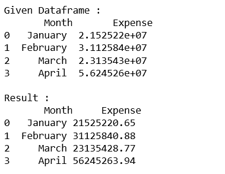
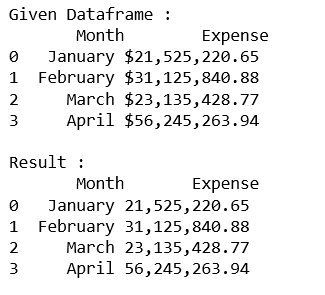
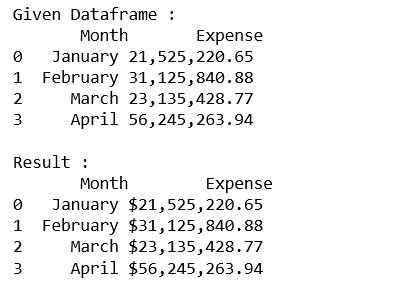

# 格式化熊猫中数据框的浮动列

> 原文:[https://www . geesforgeks . org/formatting-整数列数据框 in pandas/](https://www.geeksforgeeks.org/formatting-integer-column-of-dataframe-in-pandas/)

在展示数据的同时，以要求的格式展示数据也是一个重要而关键的部分。有时候，这个值太大了，以至于我们只想显示它的期望部分，或者我们可以用某种期望的格式来表达。

让我们看看熊猫中格式化数据帧整数列的不同方法。

**代码#1 :** 将列值四舍五入到两位小数。

```
# import pandas lib as pd
import pandas as pd

# create the data dictionary
data = {'Month' : ['January', 'February', 'March', 'April'],
     'Expense': [ 21525220.653, 31125840.875, 23135428.768, 56245263.942]}

# create the dataframe
dataframe = pd.DataFrame(data, columns = ['Month', 'Expense'])

print("Given Dataframe :\n", dataframe)

# round to two decimal places in python pandas
pd.options.display.float_format = '{:.2f}'.format

print('\nResult :\n', dataframe)
```

**输出:**


**代码#2 :** 用逗号格式化“费用”列，并四舍五入到两位小数。

```
# import pandas lib as pd
import pandas as pd

# create the data dictionary
data = {'Month' : ['January', 'February', 'March', 'April'],
        'Expense':[ 21525220.653, 31125840.875, 23135428.768, 56245263.942]}

# create the dataframe
dataframe = pd.DataFrame(data, columns = ['Month', 'Expense'])

print("Given Dataframe :\n", dataframe)

# Format with commas and round off to two decimal places in pandas
pd.options.display.float_format = '{:, .2f}'.format

print('\nResult :\n', dataframe)
```

**输出:**


**代码#3 :** 用逗号和带两位小数的美元符号格式化“费用”列。

```
# import pandas lib as pd
import pandas as pd

# create the data dictionary
data = {'Month' : ['January', 'February', 'March', 'April'],
        'Expense':[ 21525220.653, 31125840.875, 23135428.768, 56245263.942]}

# create the dataframe
dataframe = pd.DataFrame(data, columns = ['Month', 'Expense'])

print("Given Dataframe :\n", dataframe)

# Format with dollars, commas and round off
# to two decimal places in pandas
pd.options.display.float_format = '${:, .2f}'.format

print('\nResult :\n', dataframe)
```

**输出:**
