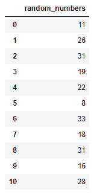
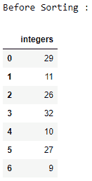
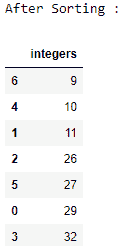
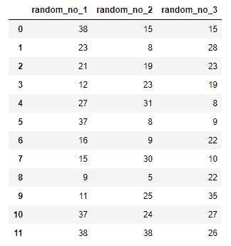
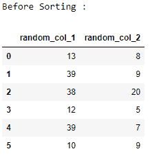
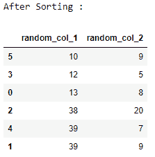

# 在熊猫数据帧中生成随机整数

> 原文:[https://www . geesforgeks . org/generating-random-整数 in-pandas-dataframe/](https://www.geeksforgeeks.org/generating-random-integers-in-pandas-dataframe/)

Pandas 是最流行的用于数据分析的 Python 库。它通过纯 C 或 Python 编写的后端源代码提供了高度优化的性能。

这里我们将看到如何在熊猫数据报中生成随机整数。我们将使用`[numpy.random.randint()](https://www.geeksforgeeks.org/numpy-random-rand-python/)`方法生成随机整数。

**例 1 :** 熊猫单数据帧列生成随机整数。

```py
# importing pandas and numpy libraries
import numpy as np
import pandas as pd

# generating 11 random integers from 5 to 35 
data = np.random.randint(5, 35, size = 11)
df = pd.DataFrame(data, columns = ['random_numbers'])

# displaying random integers in data frame
print(df)
```

**输出:**


**示例 2** :对熊猫单数据框列中的一列进行排序。

```py
# importing pandas and numpy libraries
import numpy as np
import pandas as pd

# generating 7 random integers from 5 to 35 
data = np.random.randint(5, 35, size = 7)
df = pd.DataFrame(data, columns = ['integers'])

# displaying random integers in data frame
print("Before Sorting :")
print(df)

# sorting the random integer values 
# using dataframe.sort_values()
# and displaying them 
df.sort_values("integers", axis = 0, ascending = True, 
                inplace = True, na_position ='last')

print("After Sorting :")
print(df)
```

**输出:**



**例 3 :** 在熊猫多数据帧列中生成随机整数。

```py
# importing pandas and numpy libraries
import numpy as np
import pandas as pd

# generating 12X3 i.e 36 random integers from 5 to 40 
data = np.random.randint(5, 40, size = (12, 3))
df = pd.DataFrame(data, columns = ['random_no_1',
                                   'random_no_2',
                                   'random_no_3'])

# displaying random integers in the dataframe 
print(df)
```

**输出:**


**示例 4 :** 对 Pandas 多数据框列中的随机整数列进行排序。

```py
# importing pandas and numpy libraries
import numpy as np
import pandas as pd

# generating 6x2 i.e 12 random integers
# from 5 to 40 
data = np.random.randint(5, 40, size = (6, 2))
df = pd.DataFrame(data, columns = ['random_col_1', 'random_col_2'])

# displaying random integers in data frame 
print("Before Sorting :")
print(df)

# Sorting both Random integer column 
# First column 1 is sorted 
# then for every column 1, column 2 is sorted 
# in ascending order
# using dataframe.sort_values()
df.sort_values(['random_col_1', 'random_col_2'], axis = 0, 
               ascending = [True, True], inplace = True)

print("After Sorting :")
print(df)
```

**输出:**

