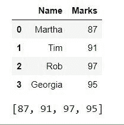
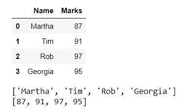

# 获取熊猫数据框的特定列值列表

> 原文:[https://www . geeksforgeeks . org/get-a-a-pands-data frame-某列值列表/](https://www.geeksforgeeks.org/get-a-list-of-a-particular-column-values-of-a-pandas-dataframe/)

在本文中，我们将看到如何以列表的形式获取 pandas 数据框中一列的所有值。这在许多情况下非常有用，假设我们必须获得某一特定学科所有学生的分数，获得所有员工的电话号码，等等。让我们看看如何借助一些例子来实现这一点。

**示例 1:** 通过使用 **tolist()** 方法，我们可以拥有列表中一列的所有值。

> **语法:** Series.tolist()。
> 
> **返回类型:**将系列转换为列表。

**代码**:

## 蟒蛇 3

```py
# import pandas libraey
import pandas as pd

# dictionary
dict = {'Name': ['Martha', 'Tim',
                'Rob', 'Georgia'],
         'Marks': [87, 91, 
                  97, 95]}

# create a dataframe object
df = pd.DataFrame(dict)

# show the dataframe
print(df)

# list of values of 'Marks' column
marks_list = df['Marks'].tolist()

# show the list
print(marks_list)
```

**输出:**



**示例 2:** 我们将了解如何在单独的列表中获取所有列的值。

**代码:**

## 蟒蛇 3

```py
# import pandas library
import pandas as pd

# dictionary
dict = {'Name': ['Martha', 'Tim', 
                'Rob', 'Georgia'],
        'Marks': [87, 91, 
                 97, 95]}

# create a dataframe object
df = pd.DataFrame(dict)

# show the dataframe
print(df)

# iterating over and calling 
# tolist() method for 
# each column
for i in list(df):

    # show the list of values  
    print(df[i].tolist())
```

**输出:**

