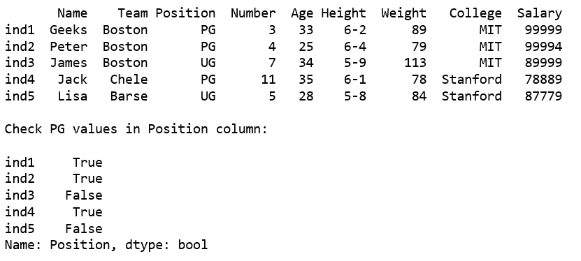
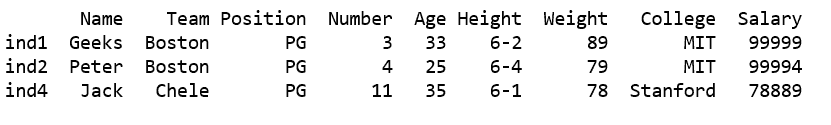
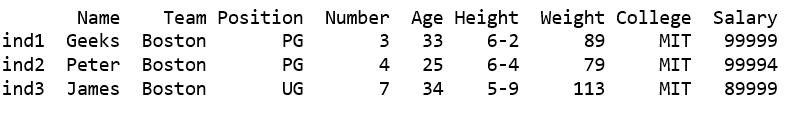
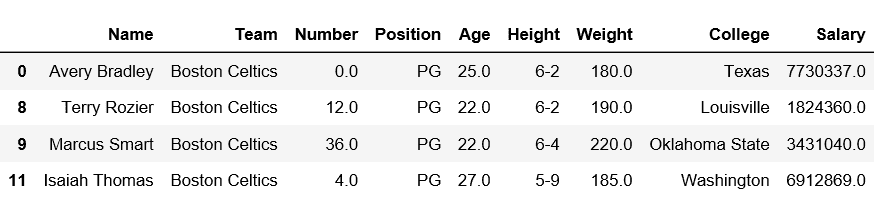
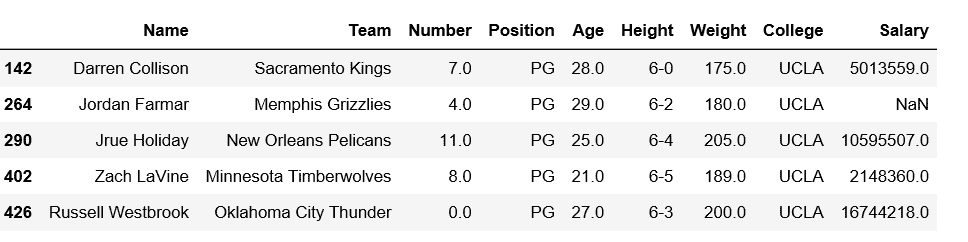

# 获取熊猫数据帧中包含给定子串的所有行

> 原文:[https://www . geesforgeks . org/get-all-row-in-a-pands-data frame-containing-给定-substring/](https://www.geeksforgeeks.org/get-all-rows-in-a-pandas-dataframe-containing-given-substring/)

借助不同的例子，让我们看看如何获取熊猫数据帧中包含给定子串的所有行。

**代码#1:** 检查列位置中的 PG 值

```
# importing pandas 
import pandas as pd

# Creating the dataframe with dict of lists
df = pd.DataFrame({'Name': ['Geeks', 'Peter', 'James', 'Jack', 'Lisa'],
                   'Team': ['Boston', 'Boston', 'Boston', 'Chele', 'Barse'],
                   'Position': ['PG', 'PG', 'UG', 'PG', 'UG'],
                   'Number': [3, 4, 7, 11, 5],
                   'Age': [33, 25, 34, 35, 28],
                   'Height': ['6-2', '6-4', '5-9', '6-1', '5-8'],
                   'Weight': [89, 79, 113, 78, 84],
                   'College': ['MIT', 'MIT', 'MIT', 'Stanford', 'Stanford'],
                   'Salary': [99999, 99994, 89999, 78889, 87779]},
                   index =['ind1', 'ind2', 'ind3', 'ind4', 'ind5'])
print(df, "\n")

print("Check PG values in Position column:\n")
df1 = df['Position'].str.contains("PG")
print(df1)
```

**输出:**


但是这个结果似乎没有太大帮助，因为它返回了带有索引的布尔值。让我们看看是否能做得更好。

**代码#2:** 获取满足条件的行

```
# importing pandas as pd
import pandas as pd

# Creating the dataframe with dict of lists
df = pd.DataFrame({'Name': ['Geeks', 'Peter', 'James', 'Jack', 'Lisa'],
                   'Team': ['Boston', 'Boston', 'Boston', 'Chele', 'Barse'],
                   'Position': ['PG', 'PG', 'UG', 'PG', 'UG'],
                   'Number': [3, 4, 7, 11, 5],
                   'Age': [33, 25, 34, 35, 28],
                   'Height': ['6-2', '6-4', '5-9', '6-1', '5-8'],
                   'Weight': [89, 79, 113, 78, 84],
                   'College': ['MIT', 'MIT', 'MIT', 'Stanford', 'Stanford'],
                   'Salary': [99999, 99994, 89999, 78889, 87779]},
                   index =['ind1', 'ind2', 'ind3', 'ind4', 'ind5'])

df1 = df[df['Position'].str.contains("PG")]
print(df1)
```

**输出:**


**代码#3:** 筛选团队包含“波士顿”或学院包含“麻省理工”的所有行。

```
# importing pandas
import pandas as pd

# Creating the dataframe with dict of lists
df = pd.DataFrame({'Name': ['Geeks', 'Peter', 'James', 'Jack', 'Lisa'],
                   'Team': ['Boston', 'Boston', 'Boston', 'Chele', 'Barse'],
                   'Position': ['PG', 'PG', 'UG', 'PG', 'UG'],
                   'Number': [3, 4, 7, 11, 5],
                   'Age': [33, 25, 34, 35, 28],
                   'Height': ['6-2', '6-4', '5-9', '6-1', '5-8'],
                   'Weight': [89, 79, 113, 78, 84],
                   'College': ['MIT', 'MIT', 'MIT', 'Stanford', 'Stanford'],
                   'Salary': [99999, 99994, 89999, 78889, 87779]},
                   index =['ind1', 'ind2', 'ind3', 'ind4', 'ind5'])

df1 = df[df['Team'].str.contains("Boston") | df['College'].str.contains('MIT')]
print(df1)
```

**输出:**


**代码#4:** 过滤行检查团队名称包含“波士顿和职位必须是 PG。

```
# importing pandas module 
import pandas as pd 

# making data frame 
df = pd.read_csv("https://media.geeksforgeeks.org/wp-content/uploads/nba.csv") 

df1 = df[df['Team'].str.contains('Boston') & df['Position'].str.contains('PG')]
df1
```

**输出:**


**代码#5:** 筛选行检查位置包含 PG，学院必须包含类似 UC。

```
# importing pandas module 
import pandas as pd 

# making data frame 
df = pd.read_csv("https://media.geeksforgeeks.org/wp-content/uploads/nba.csv") 

df1 = df[df['Position'].str.contains("PG") & df['College'].str.contains('UC')]
df1
```

**输出:**
