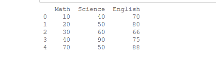
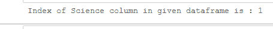
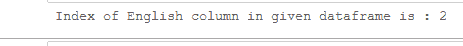

# 从给定熊猫数据框的列名中获取列索引

> 原文:[https://www . geesforgeks . org/get-column-index-from-column-给定熊猫的名字-dataframe/](https://www.geeksforgeeks.org/get-column-index-from-column-name-of-a-given-pandas-dataframe/)

在本文中，我们将看到如何从数据帧的列名中获取列索引。我们将使用[**data frame . columns**](https://www.geeksforgeeks.org/python-pandas-dataframe-columns/)**属性和[**index . get _ loc**](https://www.geeksforgeeks.org/python-pandas-index-get_loc/)**方法的 [**熊猫**](https://www.geeksforgeeks.org/pandas-tutorial/) 模块结合在一起。****

> ******语法:**数据帧.列****
> 
> ******返回:**列名索引****
> 
>  ******语法:** Index.get_loc(键，方法=无，容差=无)
> 
> **返回:** loc:如果索引唯一，则为 int，如果索引单调，则为 slice，否则为 mask****

******代码:**让我们创建一个数据帧:****

## ****蟒蛇 3****

```
**# import pandas library
import pandas as pd

# dictionary
record = {'Math': [10, 20, 30, 
                   40, 70],
          'Science': [40, 50, 60,
                      90, 50], 
          'English': [70, 80, 66, 
                      75, 88]}

# create a dataframe
df = pd.DataFrame(record)

# show the dataframe
print(df)**
```

******输出:******

****

数据帧**** 

******例 1:** 获取“科学”一栏的索引号。****

## ****蟒蛇 3****

```
**# import pandas library
import pandas as pd

# dictionary
record = {'Math': [10, 20, 30, 40, 70],
          'Science': [40, 50, 60, 90, 50], 
          'English': [70, 80, 66, 75, 88]}

# give column name
col_name = "Science"

# find the index no
index_no = df.columns.get_loc(col_name)

print("Index of {} column in given dataframe is : {}".format(col_name, index_no))**
```

******输出:******

****

科学专栏索引号**** 

******例 2:** 获取“英语”列的索引号。****

## ****蟒蛇 3****

```
**# import pandas library
import pandas as pd

# dictionary
record = {'Math': [10, 20, 30,
                   40, 70],
          'Science': [40, 50, 60,
                      90, 50], 
          'English': [70, 80, 66,
                      75, 88]}

# create a dataframe
df = pd.DataFrame(record)

# give column name
col_name = "English"

# find the index no
index_no = df.columns.get_loc(col_name)

print("Index of {} column in given dataframe is : {}".format(col_name, index_no))**
```

******输出:******

****

英文栏目索引号****