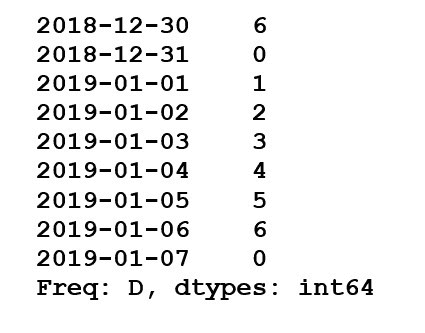
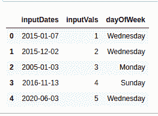
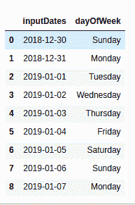

# 用熊猫-蟒蛇

从日期开始

> 原文:[https://www . geesforgeks . org/get-day-in-date-pandas-python/](https://www.geeksforgeeks.org/get-day-from-date-in-pandas-python/)

让我们讨论如何从熊猫的日期开始。做同样的事情有多种方法。为了更好地理解，让我们借助例子来浏览一下。

**示例 1 :** Pandas.dt_range 将输入作为日期范围，并返回固定频率的 DatetimeIndex。Series.dt.dayofweek 返回一周中从 0 到 6 的一天，其中 0 表示星期一，6 表示星期日。

```py
import pandas as pd

date = pd.date_range('2018-12-30', '2019-01-07',
                     freq='D').to_series()
date.dt.dayofweek
```

**输出:**


**例 2 :** 熊猫。DataFrame 充当系列对象的 dict 类型容器。pandas.to_datetime 将输入转换为 datetime。

```py
import pandas as pd

date = pd.DataFrame({'inputDate':['2020-07-07']})
date['inputDate'] = pd.to_datetime(date['inputDate'])
date['dayOfWeek'] = date['inputDate'].dt.day_name()

date
```

**输出:**


**示例 3 :** 对于多个输入日期。

```py
import pandas as pd

date = pd.DataFrame({'inputDates':['2015-01-07', '2015-12-02',
                                   '2005-01-03', '2016-11-13',
                                   '2020-06-03'], 
                     'inputVals':[1, 2, 3, 4, 5]})

date['inputDates'] = pd.to_datetime(date['inputDates'])
date['dayOfWeek'] = date['inputDates'].dt.day_name()

date
```

**输出:**



**示例 4 :** 为了以特定格式打印日期。

```py
import pandas as pd

date = pd.DataFrame({'inputDates':['1999-7-14', '1998-12-14', 
                                   '2001-01-18', '2020-07-18',
                                   '2006-01-8'], 
                     'inputVals':[1, 2, 3, 4, 5]})

date['inputDates'] = pd.to_datetime(date['inputDates'])
date['dayOfWeek'] = date['inputDates'].dt.dayofweek
days = {0:'Mon', 1:'Tues', 2:'Wed', 3:'Thurs', 4:'Fri', 5:'Sat', 6:'Sun'}
date['dayOfWeek'] = date['dayOfWeek'].apply(lambda x: days[x])

date
```

**输出:**


**示例 5 :** 将输入作为日期范围，并打印它们的名称以及给定的数字(0-6)。

```py
import pandas as pd

myDate = pd.DataFrame({'inputDates':list(pd.date_range('2018-12-30',
                                                       '2019-01-07', 
                                                       freq ='D').to_series())})

myDate['inputDates'] = pd.to_datetime(myDate['inputDates'])
myDate['dayOfWeek'] = myDate['inputDates'].dt.dayofweek
myDate['dayOfWeek'] = myDate['inputDates'].dt.day_name()

myDate
```

**输出:**

