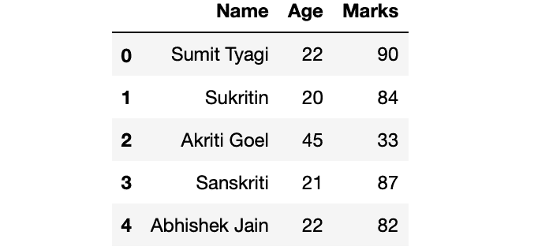
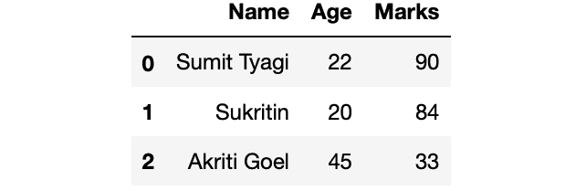
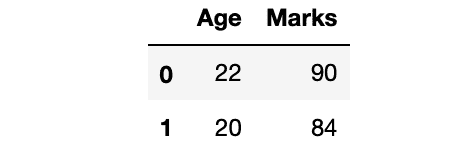

# 获取熊猫数据帧的前 n 条记录

> 原文:[https://www . geesforgeks . org/get-first-n-records-of-a-pandas-data frame/](https://www.geeksforgeeks.org/get-first-n-records-of-a-pandas-dataframe/)

让我们看看如何获取熊猫数据帧的前 n 条记录。让我们首先制作一个数据帧:

```py
# Import Required Library
import pandas as pd

# Create a dictionary for the dataframe
dict = {'Name' : ['Sumit Tyagi', 'Sukritin',
                  'Akriti Goel', 'Sanskriti',
                  'Abhishek Jain'],
        'Age':[22, 20, 45, 21, 22],
        'Marks':[90, 84, 33, 87, 82]}

# Converting Dictionary to Pandas Dataframe
df = pd.DataFrame(dict)

# Print Dataframe
print(df)
```

**输出:**



**方法 1 :** 使用`head()`方法。使用[熊猫。](https://www.geeksforgeeks.org/python-pandas-dataframe-series-head-method/)获取数据帧的前 n 行。它需要一个可选的参数 n(从开始你想要得到的行数)。默认情况下 n = 5，如果 n 的值没有传递给方法，它将返回前 5 行。

```py
# Getting first 3 rows from df
df_first_3 = df.head(3)

# Printing df_first_3
print(df_first_3)
```

**输出:**



**方法二:**使用`pandas.DataFrame.iloc()`。使用[熊猫。DataFrame.iloc()](https://www.geeksforgeeks.org/python-extracting-rows-using-pandas-iloc/) 获取前 n 行。它类似于列表切片。

```py
# Getting first 3 rows from df
df_first_3 = df.iloc[:3]

# Printing df_first_3
print(df_first_3)
```

**输出:**


**方法 3 :** 显示特定列的前 n 条记录

```py
# Getting first 2 rows of columns Age and Marks from df
df_first_2 = df[['Age', 'Marks']].head(2)

# Printing df_first_2
print(df_first_2)
```

**输出:**



**方法 4 :** 显示后 n 列的前 n 条记录。使用`pandas.DataFrame.iloc()`显示最后 n 列的前 n 条记录

```py
# Getting first n rows and last n columns from df
df_first_2_row_last_2_col = df.iloc[:2, -2:]

# Printing df_first_2_row_last_2_col
print(df_first_2_row_last_2_col)
```

**输出:**
