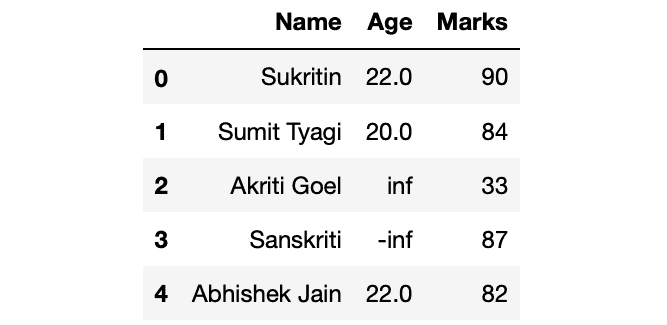
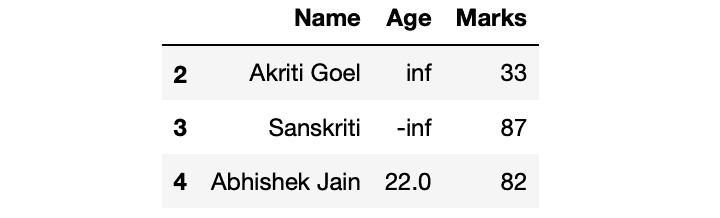

# 获取熊猫数据帧的最后 n 条记录

> 原文:[https://www . geesforgeks . org/get-last-n-records-of-a-pandas-data frame/](https://www.geeksforgeeks.org/get-last-n-records-of-a-pandas-dataframe/)

让我们讨论如何获得熊猫数据帧的最后 n 条记录。有多种方法可以获得熊猫数据帧的最后 n 条记录。让我们首先制作一个数据帧:
**示例:**

## 蟒蛇 3

```
# Import Required Libraries
import pandas as pd
import numpy as np

# Create a dictionary for the dataframe
dict = {'Name': ['Sukritin', 'Sumit Tyagi', 'Akriti Goel',
                 'Sanskriti', 'Abhishek Jain'],
        'Age': [22, 20, np.inf, -np.inf, 22], 
        'Marks': [90, 84, 33, 87, 82]}

# Converting Dictionary to Pandas Dataframe
df = pd.DataFrame(dict)

# Print Dataframe
df
```

**输出:**



**方法一:使用尾()方法**

用熊猫。获取数据帧的最后 n 行。它需要一个可选的参数 n(您希望从末尾得到的行数)。默认情况下 n = 5，如果 n 的值没有传递给方法，它将返回最后 5 行。

**语法:**

```
df.tail(n)

```

**示例:**

## 蟒蛇 3

```
# Getting last 3 rows from df
df_last_3 = df.tail(3)

# Printing df_last_3
print(df_last_3)
```

**输出:**



**方法二:利用熊猫。DataFrame.iloc**

用熊猫。DataFrame.iloc 获取最后 n 行。它类似于列表切片。
**语法:**

```
df.iloc[-n:]

```

**示例:**

## 蟒蛇 3

```
# Getting last 3 rows from df
df_last_3 = df.iloc[-3:]

# Printing df_last_3
print(df_last_3)
```

**输出:**


**方法 3:显示特定列的最后 n 条记录**
显示特定列的最后 n 条记录

## 蟒蛇 3

```
# Getting last 2 rows of columns 
# Age and Marks from df
df_last_2 = df[['Age', 'Marks']].tail(2)

# Printing df_last_2
print(df_last_2)
```

**输出:**


**方法 4:显示最后 n 列的最后 n 条记录**
使用熊猫显示最后 n 列的最后 n 条记录。DataFrame.iloc

## 蟒蛇 3

```
# Getting last n rows and last n columns from df
df_last_2_row_col = df.iloc[-2:,-2:]

# Printing df_last_2
print(df_last_2_row_col)
```

**输出:**

