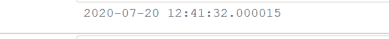
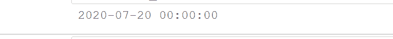
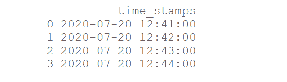
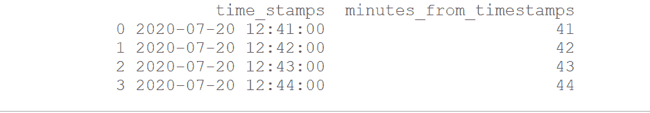
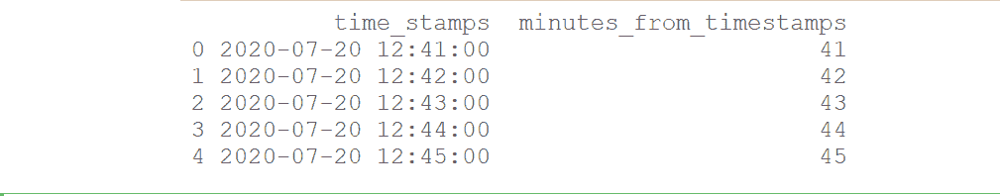

# 从熊猫-Python 中的时间戳获取分钟数

> 原文:[https://www . geesforgeks . org/get-minutes-in-timestamp-pandas-python/](https://www.geeksforgeeks.org/get-minutes-from-timestamp-in-pandas-python/)

[Pandas](https://www.geeksforgeeks.org/pandas-tutorial/) 是一个为 Python 语言构建的开源库。它提供各种数据结构和操作来处理数字数据和时间序列。

在这里，让我们使用熊猫提供的一些方法从时间戳中提取分钟的值。

**方法一:**使用 [**熊猫。**属性。](https://www.geeksforgeeks.org/python-pandas-timestamp-minute/)

熊猫的这个属性可以用来从给定的时间戳对象中提取分钟。

**示例 1:**
我们首先在下面创建一个时间戳对象:

## 蟒蛇 3

```py
# import pandas library
import pandas as pd 

# create a Timestamp object 
time_stamp = pd.Timestamp(2020, 7, 20,
                          12, 41, 32, 15) 

# view the created time_stamp
print(time_stamp)
```

**输出:**



在上面创建的时间戳对象中，分钟的值是“41”。让我们使用 **Timestamp.minute** 属性提取这个值。

## 蟒蛇 3

```py
# display the value of minute from
# the created timestamp object
print(time_stamp.minute)
```

**输出:**


**例 2:**

创建时间戳对象:

## 蟒蛇 3

```py
# import pandas library
import pandas as pd 

# create a Timestamp object 
time_stamp = pd.Timestamp(2020, 7, 20) 

# view the created time_stamp
print(time_stamp)
```

**输出:**



在上面创建的时间戳对象中，分钟的值是“0”。让我们使用**时间戳.分钟**属性**提取这个值。**

## 蟒蛇 3

```py
# display the value of minute from
# the created timestamp object
print(time_stamp.minute)
```

**输出:**


**方法二:**使用 [**系列**](https://www.geeksforgeeks.org/python-pandas-series-dt-minute/) 属性。

现在，考虑熊猫数据帧的例子，其中一列包含时间戳。在这种情况下，我们将首先使用 **Series.dt** 方法将该系列的值作为 DateTime 对象访问，然后使用 **minute** 属性从 DateTime 对象中提取分钟。

**示例 1:**
首先，创建熊猫数据框:

## 蟒蛇 3

```py
# import pandas library
import pandas as pd 

# create a series
sr = pd.Series(['2020-7-20 12:41', 
                '2020-7-20 12:42', 
               '2020-7-20 12:43',
                '2020-7-20 12:44'])

# convert the series to datetime
sr = pd.to_datetime(sr)

# create a pandas dataframe with a
# column having timestamps
df = pd.DataFrame(dict(time_stamps = sr))

# view the created dataframe
print(df)
```

**输出:**



从数据帧中的每个时间戳提取分钟:

## 蟒蛇 3

```py
# extract minutes from time stamps and
# add them as a separate column
df['minutes_from_timestamps'] = df['time_stamps'].dt.minute

# view the updated dataframe
print(df)
```

**输出:**



**例 2:**

创建熊猫数据框:

## 蟒蛇 3

```py
# import pandas library
import pandas as pd 

# create a series
sr = pd.Series(pd.date_range('2020-7-20 12:41', 
                             periods = 5,
                             freq = 'min'))

# create a pandas dataframe with a
# column having timestamps
df = pd.DataFrame(dict(time_stamps=sr))

# view the created dataframe
print(df)
```

**输出:**


从数据帧中的每个时间戳提取分钟:

## 蟒蛇 3

```py
# extract minutes from time stamps and
# add them as a separate column
df['minutes_from_timestamps'] = df['time_stamps'].dt.minute

# view the updated dataframe
print(df)
```

**输出:**

