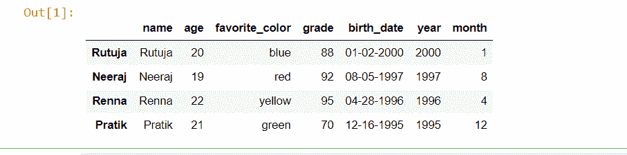
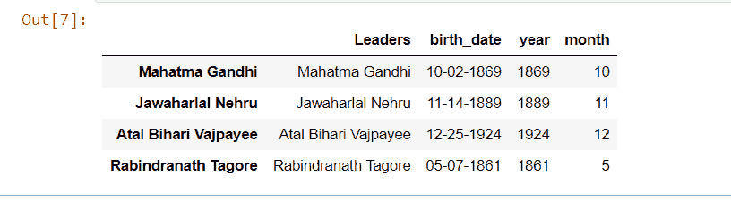

# 从熊猫-蟒蛇日期开始获取月份和年份

> 原文:[https://www . geesforgeks . org/get-熊猫年月日-python/](https://www.geeksforgeeks.org/get-month-and-year-from-date-in-pandas-python/)

[**【熊猫】**](https://www.geeksforgeeks.org/introduction-to-pandas-in-python/) 是 Python 中最强大的库之一，用于高性能和计算速度。它基本上是一个开源的 BSD 许可的 Python 库。通常，它用于探索性数据分析、机器学习、数据科学中的数据可视化等等。它具有非常动态且易于理解的语法，这使得用户的工作变得更加容易，并促进了开发人员的创新(因为 pandas 是一个开源库)。

现在让我们从安装熊猫开始。以下是在 Linux、windows 或 mac 上安装 pandas 时直接使用的命令:

```
pip install pandas
```

要在蟒蛇环境中安装熊猫，请使用:

```
conda install pandas 
```

现在让我们在编程环境中加载熊猫库。

```
import pandas as pd
```

关于熊猫的月份和日期，这是探索性数据分析的一部分。假设我们想从日期开始只访问月、日或年，我们通常使用熊猫。

**方法 1:** 使用 DatetimeIndex.month 属性查找月份，使用 DatetimeIndex.year 属性查找日期中出现的年份。

```
df['year'] = pd.DatetimeIndex(df['Date Attribute']).year
df['month'] = pd.DatetimeIndex(df['Date Attribute']).month
```

这里的“df”是熊猫数据框的对象，熊猫可以被调用为“pd”(作为导入)，“DatatimeIndex()”是熊猫中的一个函数，用于引用数据集的日期属性，“date attribute”是数据集中的日期列(它可以是任何东西，并且因数据集而异)，“year”和“month”分别是指年和月的属性。
现在我们来看一个例子:

**代码:**

## 蟒蛇 3

```
# import pandas library
import pandas as pd

# dictionary of string  key and list value
raw_data = {'name': ['Rutuja', 'Neeraj',
                     'Renna', 'Pratik'],
            'age': [20, 19, 22, 21],
            'favorite_color': ['blue', 'red',
                               'yellow', "green"],
            'grade': [88, 92, 95, 70],
            'birth_date': ['01-02-2000', '08-05-1997',
                           '04-28-1996', '12-16-1995']}

# create a dataframe object
df = pd.DataFrame(raw_data,
                  index = ['Rutuja', 'Neeraj',
                           'Renna', 'Pratik'])

# get year from the corresponding
# birth_date column value
df['year'] = pd.DatetimeIndex(df['birth_date']).year

# get month from the corresponding
# birth_date column value
df['month'] = pd.DatetimeIndex(df['birth_date']).month

# Show the dataframe
# by default 5 rows from top
df.head()
```

**输出:**



因此，在输出中可以清楚地看到，数据集的最后两列是附加的，我们使用熊猫分别存储了月份和日期。

**方法 2:** 使用 datetime.month 属性查找月份，使用 datetime.year 属性查找日期中出现的年份。

```
df['year'] = df['Date Attribute'].dt.year
df['month'] = df['Date Attribute'].dt.month
```

这里的“df”是熊猫数据框的对象，熊猫可作为“pd”(导入时)调用，datetime 可作为“dt”(导入时)调用。“日期属性”是数据集中的日期列(它可以是任何东西，因数据集而异)，“年”和“月”分别是指年和月的属性。
我们现在来看例子:

**代码**:

## 蟒蛇 3

```
# import required library
import pandas as pd
import datetime as dt

# dictionary of string as key
# and list as a value
raw_data = {'Leaders': ['Mahatma Gandhi', 'Jawaharlal Nehru',
                        'Atal Bihari Vajpayee', 'Rabindranath Tagore'],
            'birth_date': ['10-02-1869', '11-14-1889',
                           '12-25-1924', '05-07-1861']}

# create a dataframe object
df = pd.DataFrame(raw_data,
                  index = ['Mahatma Gandhi', 'Jawaharlal Nehru',
                           'Atal Bihari Vajpayee',
                           'Rabindranath Tagore'])

# get a year from corresponding
# birth_date column value
df['year'] = df['birth_date'].dt.year

# get a month from corresponding
# birth_date column value
df['month'] = df['birth_date'].dt.month

# show the dataframe
# by default first 5 rows
# from top
df.head()
```

**输出:**



因此，在输出中，可以清楚地看到，数据集的最后两列是附加的，我们使用熊猫分别存储了月份和日期。