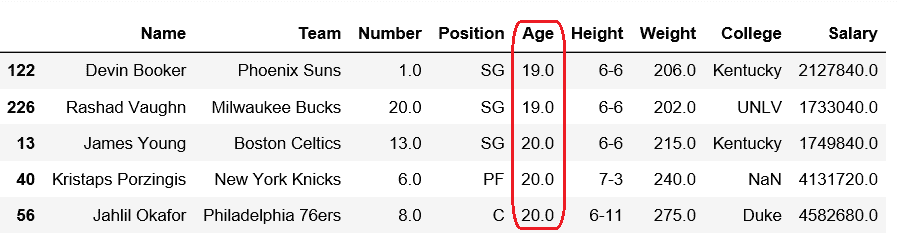
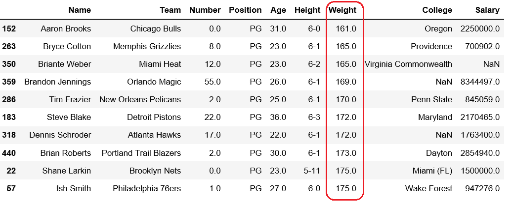
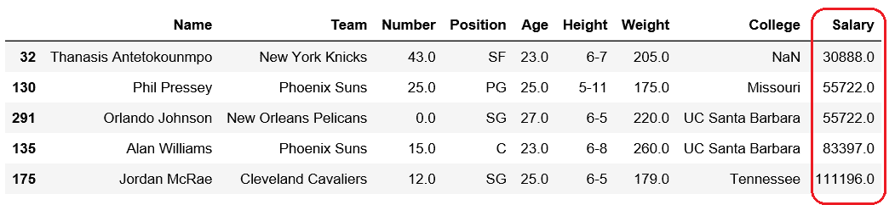

# 从熊猫数据框的特定列中获取 n 个最小值

> 原文:[https://www . geeksforgeeks . org/get-n-minist-values-from-special-in-pandas-data frame/](https://www.geeksforgeeks.org/get-n-smallest-values-from-a-particular-column-in-pandas-dataframe/)

[Pandas DataFrame](https://www.geeksforgeeks.org/python-pandas-dataframe/) 是一个二维可变大小、潜在异构的表格数据结构，带有标记轴(行和列)。

让我们看看如何从熊猫数据框的特定列中获取 n 个最小值。

首先观察这个数据集。我们将使用该数据的“年龄”、“体重”和“工资”列，以便从熊猫数据框中的特定列获取*n-最小*值。

```
# importing pandas module 
import pandas as pd 

# making data frame 
df = pd.read_csv("https://media.geeksforgeeks.org/wp-content/uploads/nba.csv") 

df.head(10)
```


**代码#1:** 获得 5 个最小年龄

```
# importing pandas module 
import pandas as pd 

# making data frame 
df = pd.read_csv("nba.csv") 

df.nsmallest(5, ['Age'])
```

**输出:**


**代码#2:** 获得 10 个最小重量

```
# importing pandas module 
import pandas as pd 

# making data frame 
df = pd.read_csv("nba.csv") 

df.nsmallest(10, ['Weight'])
```

**输出:**


**代码#3:** 拿 10 最低工资

```
# importing pandas module 
import pandas as pd 

# making data frame 
df = pd.read_csv("nba.csv") 

df.nsmallest(5, ['Salary'])
```

**输出:**
