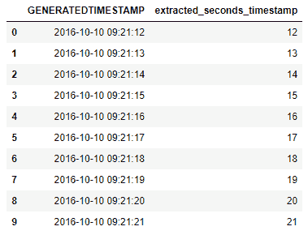
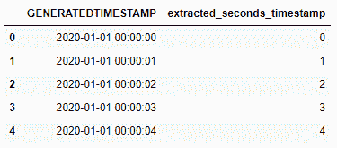

# 从 Python 中的时间戳获取秒-熊猫

> 原文:[https://www . geeksforgeeks . org/从 python 中的时间戳获取秒-pandas/](https://www.geeksforgeeks.org/get-seconds-from-timestamp-in-python-pandas/)

在这个程序中，我们的任务是用 python 创建一个程序，从给定的时间戳中提取秒。我们将使用 DataTime 对象的 s 属性来提取第二个。
**示例:**如果我们有一个包含 5 个不同时间戳的数据帧，例如:

```
Timestamp
2012-12-11 04:12:01
2013-10-13 04:12:04
2014-12-14 04:12:05
2015-11-15 04:12:06
2016-10-15 04:12:07
```

我们的任务是从给定的时间戳中提取秒。所以这里的输出将是:

```
seconds
1
4
5
6
7
```

**例 1 :**

## 蟒蛇 3

```
# importing the module
import pandas as pd

# generating 10 timestamp starting from '2016-10-10 09:21:12'
date1 = pd.Series(pd.date_range('2016-10-10 09:21:12',
                                periods = 10, freq = 's'))

# converting pandas series into data frame
df = pd.DataFrame(dict(GENERATEDTIMESTAMP = date1))

# extracting seconds from time stamp
df['extracted_seconds_timestamp'] = df['GENERATEDTIMESTAMP'].dt.second

# displaying  DataFrame
display(df)
```

**输出:**



**例 2 :**

## 蟒蛇 3

```
# importing the module
import pandas as pd

# generating 5 timestamp starting from '2020-01-01 00:00:00'
date1 = pd.Series(pd.date_range('2020-01-01 00:00:00',
                                periods = 5, freq = 's'))

# converting pandas series into data frame
df = pd.DataFrame(dict(GENERATEDTIMESTAMP = date1))

# extracting seconds from time stamp
df['extracted_seconds_timestamp'] = df['GENERATEDTIMESTAMP'].dt.second

# displaying  DataFrame
display(df)
```

**输出:**

