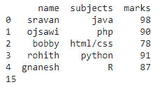
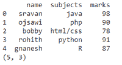
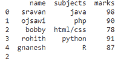

# 获取熊猫数据框的大小

> 原文:[https://www . geesforgeks . org/get-size-of-the-pandas-data frame/](https://www.geeksforgeeks.org/get-size-of-the-pandas-dataframe/)

在本文中，我们将讨论如何使用 Python 获得熊猫数据框的大小。

## 方法一:使用[测向尺寸](https://www.geeksforgeeks.org/python-pandas-df-size-df-shape-and-df-ndim/)

这将返回数据帧的大小，即行*列

**语法**:

```
dataframe.size
```

其中，dataframe 是输入数据帧

**示例**:创建学生数据框和显示大小的 Python 代码

## 蟒蛇 3

```
# import pandas module
import pandas as pd

# create a dataframe
# with 5 rows and 3 columns
data = pd.DataFrame({
    'name': ['sravan', 'ojsawi', 'bobby', 'rohith', 'gnanesh'],
    'subjects': ['java', 'php', 'html/css', 'python', 'R'],
    'marks': [98, 90, 78, 91, 87]
})

# display dataframe
print(data)

# get the size
data.size
```

**输出:**



## 方法二:使用 [df.shape](https://www.geeksforgeeks.org/python-pandas-df-size-df-shape-and-df-ndim/)

该函数将返回数据框中的行数和列数

**语法**:

```
dataframe.shape
```

其中，dataframe 是输入数据帧

**示例:**获取数据框形状的 Python 程序

## 蟒蛇 3

```
# import pandas module
import pandas as pd

# create a dataframe
# with 5 rows and 3 columns
data = pd.DataFrame({
    'name': ['sravan', 'ojsawi', 'bobby', 'rohith', 'gnanesh'],
    'subjects': ['java', 'php', 'html/css', 'python', 'R'],
    'marks': [98, 90, 78, 91, 87]
})

# display dataframe
print(data)

# get the shape
data.shape
```

**输出:**



## 方法三:使用 [df.ndim](https://www.geeksforgeeks.org/python-pandas-df-size-df-shape-and-df-ndim/)

这将返回数据框中存在的维数。

**语法**:

```
data.ndim
```

其中，dataframe 是输入数据帧

**示例:**获取数据框维度的 Python 程序

## 蟒蛇 3

```
# import pandas module
import pandas as pd

# create a dataframe
# with 5 rows and 3 columns
data = pd.DataFrame({
    'name': ['sravan', 'ojsawi', 'bobby', 'rohith', 'gnanesh'],
    'subjects': ['java', 'php', 'html/css', 'python', 'R'],
    'marks': [98, 90, 78, 91, 87]
})

# display dataframe
print(data)

# get the dimensions
data.ndim
```

**输出:**

