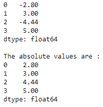
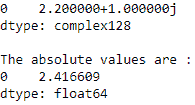
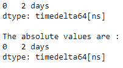
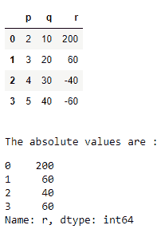

# 获取熊猫的绝对值

> 原文:[https://www . geesforgeks . org/get-the-绝对值 in-pandas/](https://www.geeksforgeeks.org/get-the-absolute-values-in-pandas/)

让我们看看如何在 Python Pandas 中获取一个元素的绝对值。我们可以使用 **`abs()`** 功能来执行这个任务。 [abs()](https://www.geeksforgeeks.org/python-pandas-dataframe-abs/) 函数用于获取每个元素的绝对数值的序列/数据帧。

> **语法:** Series.abs()或 DataFrame.abs()
> **参数** : None
> **返回:**包含每个元素绝对值的 Series/DataFrame。

**示例 1 :** 系列中的绝对数值。

```py
# import the library
import pandas as pd

# create the Series
s = pd.Series([-2.8, 3, -4.44, 5])
print(s)

# fetching the absolute values
print("\nThe absolute values are :")
print(s.abs())
```

**输出:**


**例 2 :** 复数数列中的绝对数值。

```py
# import the library
import pandas as pd

# create the Series
s = pd.Series([2.2 + 1j])
print(s)

# fetching the absolute values
print("\nThe absolute values are :")
print(s.abs())
```

**输出:**


**示例 3 :** 具有时间增量元素的序列中的绝对数值。

```py
# import the library
import pandas as pd

# create the Series
s = pd.Series([pd.Timedelta('2 days')])
print(s)

# fetching the absolute values
print("\nThe absolute values are :")
print(s.abs())
```

**输出:**


**示例 4 :** 从数据框列中获取绝对值。

```py
# import the library
import pandas as pd

# create the DataFrame
df = pd.DataFrame({'p' : [2, 3, 4, 5],
                   'q' : [10, 20, 30, 40],
                   'r' : [200, 60, -40, -60]})
display(df)

# fetching the absolute values
print("\nThe absolute values are :")
display(df.r.abs())
```

**输出:**
