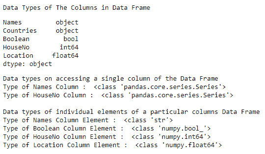
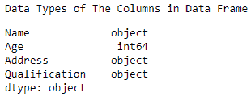

# 获取熊猫数据框各列的数据类型

> 原文:[https://www . geesforgeks . org/get-the-data type-of-a-pandas-data frame/](https://www.geeksforgeeks.org/get-the-datatypes-of-columns-of-a-pandas-dataframe/)

让我们看看如何在熊猫数据框中获取列的数据类型。要获取数据类型，我们将使用 dtype()和 type()函数。
例 1 :

## 大蟒

```
# importing the module
import pandas as pd

# creating a DataFrame   
dictionary = {'Names':['Simon', 'Josh', 'Amen', 'Habby',
                       'Jonathan', 'Nick', 'Jake'],
              'Countries':['AUSTRIA', 'BELGIUM', 'BRAZIL',
                           'JAPAN', 'FRANCE', 'INDIA', 'GERMANY'],
              'Boolean':[True, False, False, True,
                         True, False, True],
              'HouseNo':[231, 453, 723, 924, 784, 561, 403],
              'Location':[12.34, 45.67, 03.45, 17.23,
                          83.12, 90.45, 84.34]}
table = pd.DataFrame(dictionary, columns = ['Names', 'Countries',
                                            'Boolean', 'HouseNo', 'Location'])

print("Data Types of The Columns in Data Frame")
display(table.dtypes)

print("Data types on accessing a single column of the Data Frame ")
print("Type of Names Column : ", type(table.iloc[:, 0]))
print("Type of HouseNo Column : ", type(table.iloc[:, 3]), "\n")

print("Data types of individual elements of a particular columns Data Frame ")
print("Type of Names Column Element : ", type(table.iloc[:, 0][1]))
print("Type of Boolean Column Element : ", type(table.iloc[:, 2][2]))
print("Type of HouseNo Column Element : ", type(table.iloc[:, 3][4]))
print("Type of Location Column Element : ", type(table.iloc[:, 4][0]))
```

**输出**



从输出中，我们可以观察到，在访问或获取从数据框中分离出来的单个列时，其类型会转换为熊猫系列类型，而与该系列中的数据类型无关。在访问 pandas 系列的单个元素时，我们得到的数据总是以 numpy.datatype()的形式存储，要么是 numpy.int64，要么是 numpy.float64，要么是 numpy.bool_ 因此，我们观察到 Pandas 数据框自动将数据类型转换为 numpy 类格式。

**例 2 :**

## 蟒蛇 3

```
# importing the module
import pandas as pd

# creating a DataFrame   
data = {'Name' : ['Jai', 'Princi', 'Gaurav', 'Anuj'],
        'Age' : [27, 24, 22, 32],
        'Address' : ['Delhi', 'Kanpur', 'Allahabad', 'Kannauj'],
        'Qualification' : ['Msc', 'MA', 'MCA', 'Phd']}
table = pd.DataFrame(data)

print("Data Types of The Columns in Data Frame")
display(table.dtypes)
```

