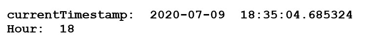
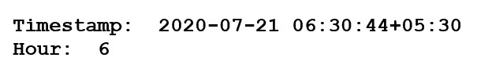
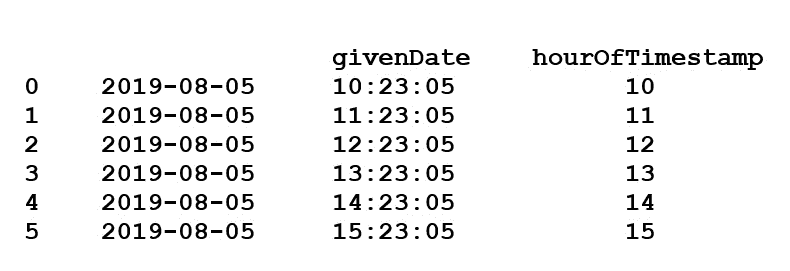
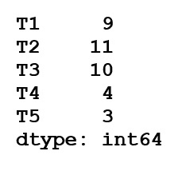
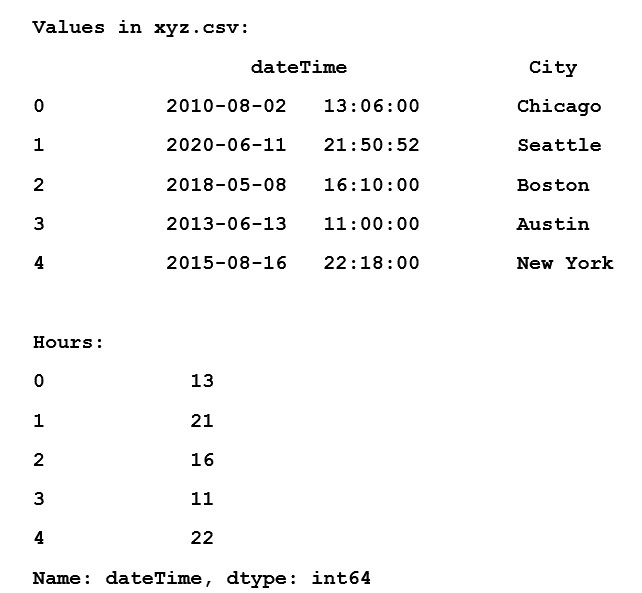

# 从熊猫的时间戳中获取小时

> 原文:[https://www . geesforgeks . org/从熊猫时间戳中获取小时数/](https://www.geeksforgeeks.org/get-the-hour-from-timestamp-in-pandas/)

让我们看看如何在多个例子的帮助下，从熊猫的时间戳中提取小时。

**示例 1 :** `[pandas.timestamp.now()](https://www.geeksforgeeks.org/python-pandas-timestamp-now/)`以时区为输入，返回该时区的当前时间戳对象。

```py
# importing the module
import pandas as pd

# input current timestamp
date = pd.Timestamp.now()
print("currentTimestamp: ", date)

# extract the Hours from the timestamp
frame = date.hour
print("Hour: ", frame)
```

**输出:**


**示例 2 :** `[pandas.timestamp()](https://www.geeksforgeeks.org/python-pandas-timestamp-timestamp/)`用于特定时区的日期时间索引。它以年、月、日、时间和时区作为输入，并返回该时区的日期时间索引。

```py
# importing the module
import pandas as pd   

# input the timestamp
date = pd.Timestamp(year = 2020, month = 7, day = 21, 
                    hour = 6, minute = 30, second = 44, 
                    tz = 'Asia / Kolkata')  
print("Timestamp: ", date)

# extract the Hours from the timestamp
print("Hour: ", date.hour)
```

**输出:**


**例 3 :** 使用`[pandas.dt_range()](https://www.geeksforgeeks.org/python-pandas-date_range-method/)`将输入作为时间戳范围，使用`[pandas.series()](https://www.geeksforgeeks.org/python-pandas-series/)`转换为时间戳数组。

```py
# importing the module
import pandas as pd 

# take input Dates in a range
dates = pd.Series(pd.date_range('2019-8-5 10:23:05', periods = 6, freq ='H'))

# convert in a dict container
frame = pd.DataFrame(dict(givenDate = dates))

# extract Hours from Timestamp
frame['hourOfTimestamp'] = frame['givenDate'].dt.hour
print(frame)
```

**输出:**


**解决方案 4 :** 使用`object.hour`属性返回给定序列对象数据中日期时间的小时。

```py
# importing the module
import pandas as pd 

# take inputs
dates = pd.Series(['2015-01-11 09:20', '2019-4-8 11:31', '2018-12-22 10:10', 
                   '2011-4-2 04:25', '2017-1-6 03:51'])  

# give a Name to the series
seriesName = ['T1', 'T2', 'T3', 'T4', 'T5']  

# give index to each timestamp
dates.index = seriesName

dates = pd.to_datetime(dates)

# extract Hours from Timestamp 
rs = dates.dt.hour  
print(rs)
```

**输出:**


**解决方案 5 :** 从 csv 文件中读取时间戳数据，并从每个时间戳中获取 Hours。

```py
# importing the module
import pandas as pd

# read the date from xyz.csv file
frame = pd.read_csv(r'xyz.csv')
print("Values in xyz.csv: ")
print(frame.head())

frame['dateTime'] = frame['dateTime'].astype('datetime64[ns]')

# extract Hours from Timestamp  
print("Hours: ")
print(frame.dateTime.dt.hour.head())
```

**输出:**
