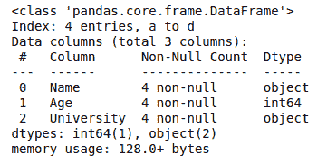

# 获取熊猫数据框的行数和列数

> 原文:[https://www . geeksforgeeks . org/get-熊猫的行数和列数-dataframe/](https://www.geeksforgeeks.org/get-the-number-of-rows-and-number-of-columns-in-pandas-dataframe/)

Pandas 为数据分析师提供了各种预定义的函数来获取数据框中的行数和列数。在本文中，我们将学习一些这样的函数的语法和实现。

#### 方法 1:使用测向轴()方法

**`axes()`** 方法在熊猫中允许一次获得行数和列数。它接受行的参数“0”和列的参数“1”。

> **语法:** df 轴[0 或 1]
> 
> **参数:**
> **0:** 代表行数
> **1:** 代表列数

**示例:**

```py
# import pandas library
import pandas as pd

# dictionary with list object in values
details = {
    'Name' : ['Ankit', 'Aishwarya', 'Shaurya', 'Shivangi'],
    'Age' : [23, 21, 22, 21],
    'University' : ['BHU', 'JNU', 'DU', 'BHU'],
}

# creating a Dataframe object 
df = pd.DataFrame(details, columns = ['Name', 'Age', 'University'],\
                  index = ['a', 'b', 'c', 'd'])

# Get the number of rows and columns
rows = len(df.axes[0])
cols = len(df.axes[1])

# Print the number of rows and columns
print("Number of Rows: " + str(rows))
print("Number of Columns: " + str(cols))
```

**输出:**

```py
Number of Rows: 4
Number of Columns: 3

```

#### 方法 2:使用 df.info()方法

`**df.info()**`方法提供关于数据帧的所有信息，包括行数和列数。

**语法:**

```py
df.info
```

**示例:**

```py
# import pandas library
import pandas as pd

# dictionary with list object in values
details = {
    'Name' : ['Ankit', 'Aishwarya', 'Shaurya', 'Shivangi'],
    'Age' : [23, 21, 22, 21],
    'University' : ['BHU', 'JNU', 'DU', 'BHU'],
}

# creating a Dataframe object 
df = pd.DataFrame(details, columns = ['Name', 'Age', 'University'],
                  index = ['a', 'b', 'c', 'd'])

# Get the info of data frame
df.info()
```

**输出:**



在上面的代码中，索引中的值给出了行数，数据列中的值给出了列数。

#### 方法 3:使用透镜()方法

**`len()`** 方法用于单独获取行数和列数。

**语法:**

```py
len(df)
and
len(df.columns)
```

**例 1:获取行数**

```py
# import pandas library
import pandas as pd

# dictionary with list object in values
details = {
    'Name' : ['Ankit', 'Aishwarya', 'Shaurya', 'Shivangi'],
    'Age' : [23, 21, 22, 21],
    'University' : ['BHU', 'JNU', 'DU', 'BHU'],
}

# creating a Dataframe object 
df = pd.DataFrame(details, columns = ['Name', 'Age', 'University'],
                  index = ['a', 'b', 'c', 'd'])

# Get the number of rows
print("Number of Rows:", len(df))
```

**输出:**

```py
Number of Rows: 4

```

**例 2:获取列数**

```py
# import pandas library
import pandas as pd

# dictionary with list object in values
details = {
    'Name' : ['Ankit', 'Aishwarya', 'Shaurya', 'Shivangi'],
    'Age' : [23, 21, 22, 21],
    'University' : ['BHU', 'JNU', 'DU', 'BHU'],
}

# creating a Dataframe object 
df = pd.DataFrame(details, columns = ['Name', 'Age', 'University'],
                  index = ['a', 'b', 'c', 'd'])

# Get the number of columns
print("Number of Columns:", len(df.columns))
```

**输出:**

```py
Number of Columns: 3

```

#### 方法 4:使用 df.shape()方法

**`df.shape()`** 方法以元组的形式返回行数和列数。

**示例:**

```py
# import pandas library
import pandas as pd

# dictionary with list object in values
details = {
    'Name' : ['Ankit', 'Aishwarya', 'Shaurya', 'Shivangi'],
    'Age' : [23, 21, 22, 21],
    'University' : ['BHU', 'JNU', 'DU', 'BHU'],
}

# creating a Dataframe object 
df = pd.DataFrame(details, columns = ['Name', 'Age', 'University'],
                  index = ['a', 'b', 'c', 'd'])

# Get the number of Rows and columns
df.shape
```

**输出:**

```py
(4, 3)
```